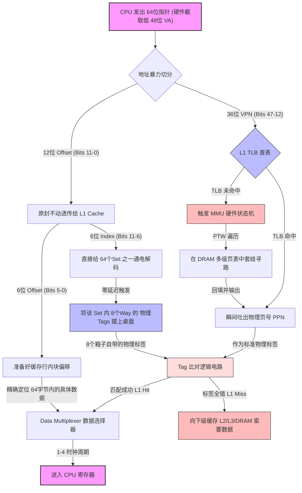

# 硬件组成

## 核心定义：代码即数据的“执行引擎”

现代存储程序式计算机（冯·诺依曼架构）的本质，是**将“死的数据”和“活的指令”扔进同一个物理存储池（内存），用一个纯粹的“计算引擎（CPU）”去无脑读取并执行。**

这里“死的”和“活的”只是角色标签，不是物理分界：**同一批字节，程序计数器（PC）指向它，它就是指令；操作数指向它，它就是数据。** 程序与数据的分别不在字节里，而在那一刻是谁在引用它。

* **物理映射的极简主义**：整个机器只有两个静态角色，加一个动作循环。
  * **执行引擎（CPU）**：只负责两件事——“算（ALU）”和“控制执行流（分支/跳转）”。它本身是个没有长期记忆的瞎子。
  * **状态容器（寄存器/内存）**：宇宙中的所有信息（图片、文字、教 CPU 怎么做加法的机器码）在这里都众生平等，全部是二进制状态的物理载体。
  * **取指-执行循环**：CPU 按时钟周期重复同一个动作循环——取指、执行、再取指。时钟周期是时钟信号一次完整的循环：方波的一个上升沿到下一个上升沿，含一高一低两段电平。注意全机没有统一的周期——不同部件各有各的时钟，周期时长各不相同。每个周期，CPU 都要通过总线向内存索取内容；而取指令和取数据共用同一条总线，一个周期只能服务一方，这就埋下了结构冲突（Structural Hazard）的隐患。

    * **L1 的分离（哈佛伪装）**：为打破这条物理限制，现代 CPU 把 L1 缓存物理劈开为 L1I（指令缓存）和 L1D（数据缓存）——指令和数据的访问模式截然不同，混居只会互相拖累。分离之后，每个周期取指、取数双管齐下，互不干扰。

    * **L2/L3 的统一（冯·诺依曼回归）**：分离止步于 L1，往下重新回归统一缓存——程序的指令和数据需求随运行不断变化，统一缓存能把容量动态倾斜给当前最饥渴的一方（比如把 90% 的空间全塞数据）；强行对半切分，只会一边闲置、一边撑爆。

    * **统一的边界（chiplet 时代）**：这里的“统一”指指令与数据混装共用缓存，而非全芯片共享一整块 L3——2019 年 AMD Zen 2 起，主流桌面 CPU 已 chiplet 化，L3 按芯片模块私有，跨模块访问延迟陡增（同期的 Intel 如 2020 年的 i7-10750H，仍是单体大 die 全核共享 12MB L3）。

    * **核心洞见**：L1 的分离是为了让流水线跑得飞起来，L2/L3 的统一是为了让缓存用得像泥巴一样灵活——前者是物理的倔强，后者是哲学的回归。

---

## 内存墙：供需、延迟与闭环

### 冯·诺依曼瓶颈的现代演进：内存墙

现代多核架构下，CPU 算力与内存供给之间的失衡被称为“内存墙（Memory Wall）”，体现在三个面向：**延迟**——一次访存花多少纳秒，几十年基本不动；**带宽**——每秒能搬多少字节，在涨但涨速远落后于算力；**容量**——模型装不下显存/内存。数据通路为：核心 → 缓存层级 → 内存控制器（IMC，集成在 CPU 内部）→ 物理内存通道 → DIMM。其中缓存层级决定**需求侧**（多少请求会漏到内存），**CPU 支持的物理内存通道（Channel）数量与频率**决定**供给侧**（内存每秒最多能搬多少字节）。

我们可以通过一个供需模型，定量估出多核系统何时会撞上这堵“墙”。将所有指标统一为：每秒字节数（Bytes/s）。

#### 供给侧（物理通道的绝对上限）

内存控制器为每条通道驱动一个 I/O 时钟，频率 $f_{clk}$（MHz，每秒百万个时钟周期）。它不是常数，而是电气负载的函数：负载越重，能稳定驱动的频率越低。DDR（Double Data Rate，双倍数据率）在一个周期的上升沿与下降沿各传输一次，故每根数据线上的传输率 $R = 2 f_{clk}$（MT/s：每秒百万次传输，MegaTransfers per second）。传输率是**每线口径**：一根数据线一秒内完成的传输次数，通道的 64 根线各自独立计数。注意这里有两个口径：内存条标签“DDR5-6400”标的是**每秒传输次数**（6400 MT/s），CPU-Z 等工具显示的“DRAM 频率”标的是**时钟频率** $f_{clk}$（3200 MHz）。

**Channel（物理内存通道）**：从内存控制器（经 PHY）引出、跨 CPU 封装引脚与主板 PCB 走线、止于 DIMM 插槽的一套独立传输总线——64 根数据线（DQ0–DQ63），外加命令/地址线与时钟线。

**DIMM（双列直插内存模组 / 内存条实物）**：插在通道尽头插槽上的硬件实体，不影响通道数目；影响只有一个方向：同一通道挂载的 DIMM 越多，电气负载越重，只能压低 $f_{clk}$。它的收益在公式之外：容量增加可以消除因内存不足把冷数据换出到硬盘 Swap 区的卡顿（DRAM 访存几十 ns 对 SSD 几十 μs，差三个数量级）。


$$\boxed{B_{\text{supply}} = N_{\text{channel}} \times \underbrace{f_{clk} \times 2}_{\text{MT/s}} \times \underbrace{\frac{64\text{ bit}}{8\text{ bit/Byte}}}_{8\text{ Byte}}}$$

其中 $N_{\text{channel}}$ 是物理通道数，由 CPU 架构与主板布线物理焊死，不随 DIMM 插入数量改变。以主流 XMP 档 DDR5-6400 双通道为例： $f_{clk} = 3200\text{ MHz}$，传输率 $= 3200 \times 2 = 6400\text{ MT/s}$，单通道 $6400 \times 8 = 51.2\text{ GB/s}$，双通道 $B_{\text{supply}} = 102.4\text{ GB/s}$。若每通道改插 2 根 DIMM，电气负载把 $f_{clk}$ 压到 2400 MHz（4800 MT/s），双通道供给缩为 $4800 \times 8 \times 2 = 76.8\text{ GB/s}$ ——容量翻倍，峰值带宽反降约 25%。

**总线位宽与颗粒拼装**：先看一笔请求的到达路径。核心需要的数据不在任何一级缓存中（缓存未命中，Cache Miss）时，请求穿透 L3、走出 CPU 封装，落到内存控制器；控制器把它翻译成一条读命令，经通道的命令/地址总线送到尽头插槽上的 DIMM。这条命令要搬回一条 64 字节的缓存行（Cache Line——缓存与内存之间的最小搬运单位）；而供给公式里的 64 bit 数据通路并不接在同一颗芯片上——它由 DIMM 上的多颗颗粒拼出。

在 DDR4 内存条上，整条内存通道是单一的 64-bit 宽总线。单颗 DRAM 颗粒（内存条上焊着的黑色芯片，每颗是一块独立的 DRAM die）却没有 64 根数据引脚——x8 颗粒只有 8 根（x16 颗粒 16 根，消费级 DIMM 以 x8 为主）。一根 DIMM 把 8 颗 x8 颗粒并排焊接，每颗分走 8 根数据线（第 1 颗 DQ0–DQ7、第 2 颗 DQ8–DQ15，依此类推），合力拼出通道的 64 bit；命令/地址总线则广播到全部 8 颗，8 颗同步动作，内存控制器看到的是一个整体。于是每个时钟沿 64 根线各传 1 bit，一次传输搬运 $64 \div 8 = 8$ 字节；一条读/写命令让每根数据线连续传输的次数称突发长度（Burst Length，BL），DDR4 固定为 8（DDR5 翻倍为 16，原因见下文子通道一段）。一条命令因此搬运 $8 \times 8 = 64$ 字节，恰为一条缓存行。

BL 是颗粒外部的口径——一条命令在每根数据线上的传输次数。这 BL 次的数据由颗粒内部供出：每根 DQ 引脚背后有一个预取缓冲，它是一个并入串出移位寄存器（PISO，Parallel-In Serial-Out）。缓冲两侧速率悬殊：DRAM 阵列是模拟电路（数据是电容里的电荷，读出要经位线泄放与感测放大器检测），内部时钟钉在 400 MHz、周期 2.5 ns；外部引脚的传输率则逐代翻倍。工作过程分两步：列选通（CAS，选中列触发读出）触发一次阵列访问时，每根 DQ 引脚对应的 N 个存储单元在一个阵列周期内被并行取出，装入 PISO；随后移位寄存器以 $f_{clk}$ 双沿把这 N bit 逐位移出到引脚上。这套“内部并行取、外部串行发”的机制称为预取（Prefetch）：

```
【DRAM 颗粒内部：400 MHz 阵列（空间域：一次并行抓取 N bit）】

   Bit 0    Bit 1    Bit 2   ...   Bit (N-1)
     │        │        │               │
     ▼        ▼        ▼               ▼
┌──────────────────────────────────────────┐
│  预取缓冲（PISO 并入串出移位寄存器）        │ ◄── 一次阵列访问（2.5 ns）装填 N bit
└───────────────────┬──────────────────────┘
                    ▼
          高速输出驱动器（以 f_clk 双沿逐位移出）
                    │
                    ▼
            外部引脚 DQ0 ───► 连续传输 BL 次（每个时钟沿 1 bit）
                              （时间域：串行喷出）
```

PISO 装入 N bit、移出 N 次，BL = N 由结构决定。同一批数据的两种搬法写成等式：

$$\underbrace{1\text{ 根外部引脚} \times BL\text{ 次串行传输}}_{\text{时间域（外部高频）}} \equiv \underbrace{N\text{ 个存储单元} \times 1\text{ 次并行抓取}}_{\text{空间域（内部低频）}}$$

预取宽度与突发长度在规范中总是成对给出——它们由同一个结构参数决定，本来就是一个数。

这条结构链同时给出速率：阵列每个 2.5 ns 向一根引脚供出 N bit，该引脚能支撑的传输率 $R = N \times 400\text{ MHz}$ ——预取宽度是倍频器的倍数，400 MHz 是被放大的基频。基频难动，提高每线传输率的唯一途径是加大 N；外部 I/O 时钟只是按 N 配套的节拍（双沿下 $f_{clk} = R \div 2 = N \times 200\text{ MHz}$ ）。

代入 DDR4-3200：N 取 8（8n；n 是颗粒位宽这个单位，有用的只是前面的数字）， $R = 8 \times 400\text{ MHz} = 3200\text{ MT/s}$ ，外部配 $f_{clk} = R \div 2 = 1600\text{ MHz}$ 。x8 颗粒一次抓出 64 bit；BL = 8，8 次传输恰占 $8 \times 0.3125\text{ ns} = 2.5\text{ ns}$ ，缓冲喷空时阵列正好交出下一批。整条通道：8 颗颗粒合计 $8 \times 64 = 512\text{ bit} = 64$ 字节——一条命令、一个阵列周期，正好一条缓存行。

DDR5 的差异沿同一条链长出：N 翻倍到 16（16n），每线传输率随之翻倍到 $R = 6400\text{ MT/s}$ （ $f_{clk} = 3200\text{ MHz}$ ），每线 16 次传输仍恰占 2.5 ns（ $16 \times 0.15625\text{ ns} = 2.5\text{ ns}$ ）。但 64 bit 通道配 BL16 意味着一条命令搬 $16 \times 64 = 1024\text{ bit} = 128$ 字节——两条缓存行，随机访问浪费一半。DDR5 因此把单根 DIMM 劈成两个独立的 32bit 子通道（各 4 颗 x8、各自的命令/地址总线，可同时各派一条命令），一条命令落回 $32 \times 16 = 512\text{ bit} = 64$ 字节。**子通道首先是粒度维持装置**，独立命令总线带来的调度收益是顺带的红利（下文非稳态一段展开）。双沿传输下一条命令占用总线 $\text{BL} \div 2$ 个时钟周期（ $t_{CK} = 1/f_{clk}$ ）：DDR4 为 4 个，DDR5 为 8 个。三代规格沿因果链摆在一起（DDR3 给出趋势端点：阵列从 200 MHz 提到 400 MHz 后钉住）；每行“阵列周期”与“喷完耗时”两列相等，正是守恒的读数：

| 规格 | 阵列周期（原点） | 每线传输率 | 预取（单颗一次抓取） | BL | 通路拼装（颗粒 × 引脚 = 位宽） | 一条命令（位宽 × BL） | 喷完耗时 |
|------|------|------|------|------|------|------|------|
| DDR3-1600 | 5.0 ns（200 MHz） | 1600 MT/s | 8n（64 bit） | 8 | 8 × 8 = 64 bit | 64 × 8 = 512 bit | 5.0 ns |
| DDR4-3200 | 2.5 ns（400 MHz） | 3200 MT/s | 8n（64 bit） | 8 | 8 × 8 = 64 bit | 64 × 8 = 512 bit | 2.5 ns |
| DDR5-6400 | 2.5 ns（400 MHz） | 6400 MT/s | 16n（128 bit） | 16 | 4 × 8 = 32 bit | 32 × 16 = 512 bit | 2.5 ns |

回到组装公式描述的工作状态看这笔账：稳态（事务首尾相接、总线零空泡）下，单通道的每根数据线每个时钟沿都在传——每周期吞吐 = 64 线 × 2 次 $= 16\text{ B}$ ，带宽 $= 16\text{ B} \times f_{clk}$ 。两代共用这一模式，唯一变量是频率： $f_{clk}$ 从 1600 翻倍到 3200 MHz，带宽随之从 25.6 翻倍到 51.2 GB/s（即供给侧公式的代入）。而拆分对这笔账的贡献是零：通道数、 $f_{clk}$ 、双沿、位宽（64 = 32 + 32）一个因子没动。

子通道真正的收益在**非稳态**：一旦事务流被打断，两条独立子通道提供两层缓冲——一层在数据总线侧填充已出现的空泡，一层在命令总线侧压低空泡的产生：

1. **数据总线侧：解耦队列，消除线头阻塞（Head-of-Line Blocking）**：DDR4 的一条 64bit 总线只有一条命令队列——假设前一笔事务因 DRAM 内部操作（行冲突后的预充电、激活等阵列收尾工作）要等 20 个 $t_{CK}$，整条总线只能停摆，后一笔早已就绪的事务也只能干等；DDR5 的两条子通道各有独立队列——子通道 A 停滞时，子通道 B 立刻投入工作，把后一笔运送出去。同样一笔停滞，DDR4 的总线利用率为 0%，DDR5 保住一半。
2. **命令总线侧：调度窗口翻倍**：DDR4 的一根命令/地址总线要喂饱整条 64bit 数据总线——每 4 个 $t_{CK}$ 必须调度出一条数据命令，被激活、预充电、刷新等命令挤占时数据总线就断流；DDR5 每条子通道有自己的命令/地址总线，且一笔事务要传 8 个 $t_{CK}$，每 8 个周期才需要一条数据命令——挤占造成断流的概率大降。

空泡有多大、值不值得填，看阵列死时间与传输占用周期的比例：以 DDR5 高频档的时序口径（预充电、行激活各约 45 个 $t_{CK}$ ），一次行冲突要等两者合计约 90 个——它只锁住阵列中涉及冲突的那一小块，其余部分照常可调度，这种**局部空泡**才是兄弟子通道填得上的；一次全阵列刷新要等约 950 个（tRFC 的绝对时间约 300 ns，跨代际基本不动，DDR5-6400 下折合更多拍），它锁住的是整个阵列——两条子通道一起停摆，谁也填不了（DDR5 另提供 same-bank refresh：只刷新阵列中指定的存储块、其余照常服务，把刷新也变成局部空泡）。相对一笔事务的 8 个 $t_{CK}$ ，可填的局部空泡已大出一个数量级（上文举例的 20 个 $t_{CK}$ 已属保守）。

#### 需求侧与临界核数

真正消耗内存带宽的，只有缓存未命中（Cache Miss）时穿透 L3、走出 CPU 封装的请求——L1/L2 的未命中由片上互连兜住（片上 SRAM 聚合带宽 TB/s 量级，不会塞车），而外部通路被通道数 × 位宽 × 频率封顶。正是这层拦截让现代 CPU 敢堆 64 核甚至 128 核。按一个假想口径粗算：**每个核心永不停顿地全速发射请求、未命中率固定**，则全机每秒向内存索要

$$B_{\text{demand}} = N_{\text{CPU}} \times R_{\text{core max}} \times M_{\text{rate}}$$

（ $N_{\text{CPU}}$ ：核心数； $R_{\text{core max}}$ ：单核极限访存速率； $M_{\text{rate}}$ ：最后一级缓存未命中率。）它顶到供给时对应的核心数，记为**临界核数**：

$$\boxed{N_{\text{critical}} = \frac{B_{\text{supply}}}{R_{\text{core max}} \times M_{\text{rate}}}}$$

其中 $M_{\text{rate}}$ 不是 L3 单独的本地未命中率，而是**全局最后一层未命中率**：设 $M_i$ 为第 $i$ 层的局部未命中率，请求从 L1 出发连穿三道防线漏出外部的概率逐级相乘，即 $M_{\text{rate}} = M_1 M_2 M_3$——多级缓存串联就是一个带宽过滤器（漏斗）。假设单核全速产生 100 GB/s 需求，L1 拦住 90%（ $M_1 = 10\\%$）、L2 拦住剩下的 80%（ $M_2 = 20\\%$）、L3 再拦住剩下的 50%（ $M_3 = 50\\%$），漏到内存通道的只剩 1 GB/s；代入本节前文 DDR5 双通道的 $B_{\text{supply}} \approx 102.4\ \text{GB/s}$，约 102 个核心的假想需求恰好顶满供给。反之若代码写得极差（完全随机访问大数组），乘积变成 $20\\%$，仅 6 个核心就能越过供给。

这只是假想口径下的标尺：真实核心等不到数据会停转，越过去不会瘫痪、只会集体降速。从公式看，推迟撞墙只有两条路——做大分子（加物理通道，如 EPYC 12 通道 DDR5）、做小分母（优化局部性压低 $M_{\text{rate}}$）。

#### 时钟域：一条访存路上的五组节拍

前文“核心定义”一节埋过一个伏笔：全机没有统一的周期。时钟的源头是主板上一颗 100 MHz 基准晶振（BCLK），它并不直接驱动任何部件；芯片内各组锁相环（PLL，Phase-Locked Loop——把低频参考倍频并锁定相位的高频时钟发生器）按各自的倍频比拉出独立时钟域（如核心 ×50 得 5.0 GHz、内存 ×16 得 1600 MHz）。域内所有触发器共享同一节拍；域与域之间频率独立，运行中还可各自升降。一条访存请求从核心到 DRAM 颗粒，要依次穿越五个时钟域（以 DDR4-3200 的 Intel 平台为例——AMD Zen 的 L3 与核心同域，相当于少一个域；核心与 Uncore 频率为假设值，实际随睿频与负载浮动）：

| 时钟域 | 频率（周期） | 域内有什么 | 跨入本域的代价 |
|------|------|------|------|
| 核心域 | ~5.0 GHz（~0.2 ns，假设值） | 流水线、L1/L2 | —（请求在此产生） |
| 互连/L3 域（Uncore） | ~3.2 GHz（~0.31 ns，假设值） | Ring/Mesh 总线、共享 L3 | 异步 FIFO 同步，约 3~5 个接收域周期（~1 ns 量级） |
| 内存控制器域（IMC） | 1600 MHz（0.625 ns） | 地址解码、命令调度 | 同上量级的跨域同步 |
| 内存 PHY/总线域 | 1600 MHz（3200 MT/s） | PHY、主板走线、64 bit 通道 | 信号离片，板级飞行 ~1 ns 量级 |
| DRAM 阵列域 | 400 MHz（2.5 ns） | 存储阵列、感测放大器（兼行缓冲） | 模拟死时间：tRCD、tRP 各 10~15 ns |

域与域之间不能直接传递信号：频率与相位都对不上，接收端在采样沿撞上正在翻转的信号会落入亚稳态（不定电平）。跨域交接（CDC，Clock Domain Crossing）靠异步 FIFO 完成——写入侧按自己的时钟入队，指针经格雷码转换与两级触发器打拍同步到接收域，以此压住亚稳态；代价是每跨一次垫入几个接收域周期的固定延迟，一次访存至少跨三次（核心 → Uncore → IMC → PHY）。注意 DDR4 下 IMC 与内存时钟同频（Gear 1，1:1），这次跨域是同步的、代价最小；DDR5-6400 则不同——IMC 的调度逻辑跑不动 3200 MHz，降为半速运行（Gear 2，1600 MHz），每两个 $t_{CK}$ 生成一条命令交 PHY 串行化。

延迟构成由此看清：一次访存约 100 ns 里，总线传输只占 2.5 ns（供给侧的喷完耗时），跨域同步与板级飞行合计不过几纳秒，阵列域的模拟死时间——行激活到可读的等待（tRCD）、预充电（tRP）各 10~15 ns——占两三成，却是唯一不可压缩的部分：它由电容充放电的物理决定，几十年来几乎不动（其余时间耗在缓存层级查找、IMC 调度等环节，随工艺与架构迭代持续压缩）。这就是延迟墙的最深根源，也是供给侧一节中“阵列死时间”与非稳态空泡的出处。DDR5 的其余差异（16n 预取、BL16、子通道拆分）与时钟域的划分无关。

---

### 局部性原理的缓存命中率模型（AMAT）

程序的时间局部性（Temporal Locality）和空间局部性（Spatial Locality）决定了缓存效率。本节采用平均内存访问时间（Average Memory Access Time，AMAT）模型，用“敲门与开门”的比喻来清晰区分两种本质不同的量。

---

#### 一、核心概念：增量延迟（Incremental Latency）与“敲门成本”

访问某一层 Cache 时，无论最终是否命中，访问动作本身就要消耗时间。在体系结构中，**敲门成本**的真实物理含义是：**访问该层 Cache 必须完成的所有硬件前置与读取动作。** 无论是 Hit 还是 Miss，这扇门你都必须先敲，成本必定发生。

以 L1 为例，一次访问的完整“敲门”动作包含：

```
地址解码（Address Decode）
    ├── 虚拟地址 → 物理地址（TLB 并发查询；若 TLB 未命中，还需查页表）
    ├── Index 位提取（来自虚拟地址，VIPT 方式）→ 选中目标 Set
    └── Tag 位提取（来自物理地址）→ 与 Tag Array 比对
数据读取（Data Array Access）
    └── 命中后，根据 Offset 取出目标字节 → 返回 CPU
```

**敲门成本的“层级递减”特性：**

进入 L2 甚至更深层级时，不需要再像 L1 那样做繁重的虚拟地址翻译（TLB）。因为在 L1 阶段，物理地址已经获取完毕。L2 拿到物理地址后，直接提取物理 Index 和 Tag 进行比对。

> 结论：每一层的敲门成本 $\ell_i$ 都是该层**独有的、纯粹的硬件动作耗时**。

| 符号 | 含义 | 物理图像 |
|------|------|----------|
| $T_i$ | 从第 $i$ 层出发的 AMAT | CPU 感受到的平均访存时间；递归定义： $T_i = \ell_i + M_i \cdot T_{i+1}$ |
| $\ell_i$ | 第 $i$ 层增量延迟（敲门成本） | 只要你向第 $i$ 层发起了访问，就**必定付出**的过路费 |
| $L_i$ | 第 $i$ 层总命中时间 | 从 CPU 出发，一路过关斩将直到在第 $i$ 层拿到数据，**累计付出的总时间**（ $\ell_1 + \ell_2 + \cdots + \ell_i$） |
| $M_i$ | 第 $i$ 层局部未命中率 | 到了第 $i$ 层却吃闭门羹，被迫继续向下的概率 |
| $H_i$ | 第 $i$ 层局部命中率 | $1 - M_i$，在第 $i$ 层成功拿到数据并终止旅程的概率 |

$M_i$ 从何而来由局部性回答：刚访问过的数据大概率很快再用（时间局部性），相邻地址大概率随后被用（空间局部性——缓存行一次搬 64 字节正是在赌它），所以各层 $H_i$ 普遍很高。局部性一旦消失， $M_i$ 逼近 1，AMAT 的每一项都退化为 $\ell_{\text{mem}}$，缓存层级失去存在意义。本节把 $M_i$ 当作给定参数，只算给定之后的账。

局部性崩溃的代价立刻可见：**时间局部性崩溃**——链表指针追逐、图随机遍历、哈希表探测，每次访存几乎必然 Miss，CPU 停顿约 100 ns（2.6 GHz 下约 260 个周期，足以执行数百条指令）；**空间局部性崩溃**——结构体混入热字段与冷字段，即便只访问热字段，整个缓存行仍被加载，污染 L1 空间且浪费带宽。

---

#### 二、计算 AMAT 的两种等效视角：算的是同一笔账

把整个存储层级（L1 → L2 → L3 → 主存）看作一个整体时，如何计算平均访存时间？这里存在两种在物理和数学上**完全等价**的建模视角，它们的区别仅仅是**“记账方式”不同**。

> **核心比喻**：递推式是“按经过的收费站（动作）记账”，概率加权式是“按最终到达的目的地（位置）记账”。两者算的是同一笔物理账单，所以必然等价。

##### 视角一：按“动作”记账（增量延迟/递推式）

**核心逻辑：既然每次向下访问都必定付出当前层的敲门成本，那就把必然发生的时间提取出来。**

- 敲 L1 的门是 100% 发生的，直接记账 $\ell_1$。
- 只有在 L1 Miss 时（概率 $M_1$），才会去敲 L2 的门，记账 $M_1 \ell_2$。
- 只有在 L1 和 L2 都 Miss 时（概率 $M_1 M_2$），才会去敲 L3 的门，记账 $M_1 M_2 \ell_3$。

$$
T_1 = \underbrace{\ell_1}_{\text{必然敲L1}} + \underbrace{M_1 \ell_2}_{\text{可能敲L2}} + \underbrace{M_1 M_2 \ell_3}_{\text{可能敲L3}} + \underbrace{M_1 M_2 M_3 \ell_{\text{mem}}}_{\text{可能敲主存}}
$$

> **关键点**：敲门成本 $\ell_i$ 前面乘的不是命中率，而是**到达这一层的概率**。只要到达，就必须付钱。

##### 视角二：按“终点”记账（全局命中/概率加权式）

**核心逻辑：追问数据最终到底在哪一层被找到（互斥事件），然后乘以到达该终点所付出的“累计总时间”。**

要在第 $i$ 层命中，必须先敲过前面所有的门。因此“总命中时间”是敲门到该层为止的**累计时间**：

$$
L_1 = \ell_1, \quad L_2 = \ell_1 + \ell_2, \quad L_3 = \ell_1 + \ell_2 + \ell_3, \quad L_{\text{mem}} = \ell_1 + \ell_2 + \ell_3 + \ell_{\text{mem}}
$$

在第 $i$ 层命中 = 敲过所有前面的门，被第 $i$ 层开门：

$$
T_1 = \underbrace{H_1 L_1}_{\text{终点是L1}} + \underbrace{M_1 H_2 L_2}_{\text{终点是L2}} + \underbrace{M_1 M_2 H_3 L_3}_{\text{终点是L3}} + \underbrace{M_1 M_2 M_3 L_{\text{mem}}}_{\text{终点是主存}}
$$

展开含义（按概率从高到低）：

- $H_1 L_1$：数据在 L1 被找到（概率 $H_1$，耗时 $L_1 = \ell_1$）
- $M_1 H_2 L_2$：数据在 L2 被找到（概率 $M_1 H_2$，耗时 $L_2 = \ell_1 + \ell_2$）
- $M_1 M_2 H_3 L_3$：数据在 L3 被找到（概率 $M_1 M_2 H_3$，耗时 $L_3$）
- $M_1 M_2 M_3 L_{\text{mem}}$：数据在主存被找到（概率 $M_1 M_2 M_3$，耗时 $L_{\text{mem}}$）

---

#### 三、为什么它们完全等价？（代数证明）

很多初学者误以为“把内存看作整体时，只能用概率加权式”。这是思维误区。我们将“视角二（概率加权）”彻底展开，按 $\ell_i$ 重新合并同类项，看看每一笔“过路费”到底向谁收了：

$$
\text{对于 } \ell_1: \underbrace{H_1}_{1-M_1} + \underbrace{M_1 H_2}_{M_1(1-M_2)} + \underbrace{M_1 M_2 H_3}_{M_1 M_2(1-M_3)} + \underbrace{M_1 M_2 M_3}_{\text{去主存的人}} = 1
$$

*含义：不管你在哪层找到数据，所有人都得付 L1 的敲门费，系数为 1*

$$
\text{对于 } \ell_2: \underbrace{M_1 H_2}_{M_1(1-M_2)} + \underbrace{M_1 M_2 H_3}_{M_1 M_2(1-M_3)} + \underbrace{M_1 M_2 M_3}_{\text{去主存的人}} = M_1
$$

*含义：只有经过 L1 未命中的那部分人，才需要付 L2 的敲门费，系数为* $M_1$

$$
\text{对于 } \ell_3: \underbrace{M_1 M_2 H_3}_{M_1 M_2(1-M_3)} + \underbrace{M_1 M_2 M_3}_{\text{去主存的人}} = M_1 M_2
$$

*含义：只有经过 L1/L2 未命中的那部分人，才需要付 L3 的敲门费，系数为* $M_1 M_2$

数学上完美闭环：

$$
\boxed{\text{概率加权式的展开结果} \equiv \ell_1 + M_1 \ell_2 + M_1 M_2 \ell_3 + M_1 M_2 M_3 \ell_{\text{mem}} \equiv \text{递推式}}
$$

---

#### 四、直观的数据实例验证

设典型 x86-64（如 AMD Zen 3）架构参数：

- 敲门费（增量延迟）： $\ell_1 = 4$ 周期， $\ell_2 = 12$ 周期， $\ell_3 = 40$ 周期， $\ell_{\text{mem}} = 260$ 周期（≈100ns @2.6GHz，与前文口径一致）。
- 累计耗时（总时间）： $L_1 = 4$， $L_2 = 16$， $L_3 = 56$， $L_{\text{mem}} = 316$。
- 未命中率： $M_1 = 0.05$， $M_2 = 0.10$， $M_3 = 0.20$。

**用递推式计算（极速版）**：

$$
T_1 = 4 + (0.05 \times 12) + (0.005 \times 40) + (0.001 \times 260) = \mathbf{5.06 \text{ 周期}}
$$

**用概率式计算（追踪终点版）**：

- L1 命中（终点 L1）：概率 $0.95$，耗时 4 → $0.95 \times 4 = 3.80$
- L2 命中（终点 L2）：概率 $0.05 \times 0.90 = 0.045$，耗时 16 → $0.045 \times 16 = 0.72$
- L3 命中（终点 L3）：概率 $0.05 \times 0.10 \times 0.80 = 0.004$，耗时 56 → $0.004 \times 56 = 0.224$
- 去往主存（终点 Mem）：概率 $0.05 \times 0.10 \times 0.20 = 0.001$，耗时 316 → $0.001 \times 316 = 0.316$
- **合计**： $3.80 + 0.72 + 0.224 + 0.316 = \mathbf{5.06 \text{ 周期}}$

**缓存层级访问流程（视角一）**：

```
L1 --> ℓ1 = 4        (100% 到达)
  \ miss (5%)
   L2 --> ℓ2 = 12     (5% 到达)
     \ miss (10%)
      L3 --> ℓ3 = 40  (0.5% 到达)
        \ miss (20%)
         DRAM --> ℓmem = 260 (0.1% 到达)
```

---

#### 五、两种等效视角的比较与工程指导

不存在“把内存看作整体时不能用递推式”的说法，它们是同一条物理真理的一体两面。在实际工程中，两者的应用场景各有侧重：

| 视角 | 物理思维 | 数学特征 | 工程用途 |
|------|----------|----------|----------|
| **递推式**（增量延迟） | 流水线思维（看路径）：关注每一次跨越层级的动作成本 | 提取公因式，极其精简 | **硬件架构师最爱。** 方便快速心算，用来评估某条互连总线或某级缓存设计的延迟红利 |
| **概率加权式**（全局命中） | 分布思维（看位置）：关注数据最终驻留在哪里 | 全概率公式，互斥展开 | **软件/性能调优工程师最爱。** 直观展示各个层级对访存时间的“贡献占比”，一眼看出性能瓶颈究竟在哪一层 |

---

### 延迟与带宽的统一：AMAT 视角下的内存墙

AMAT 度量“每次访存等多久”（延迟），内存墙度量“所有核心每秒向内存要多少数据”（带宽）。两者描述同一物理过程，由同一个系数连接。

#### 一、同一个系数，两种度量

把 AMAT 递推式按“是否走出 CPU 封装”重新分组：

$$
T_1 = \underbrace{(\ell_1 + M_1 \ell_2 + M_1 M_2 \ell_3)}_{\text{片内完成，零外部带宽消耗}} + \underbrace{M_1 M_2 M_3 \cdot \ell_{\text{mem}}}_{\text{穿过漏斗，消耗外部带宽}}
$$

前半段在芯片内部完成，不消耗外部内存带宽。末项对应真正走向主存的访问：按 $M_1 M_2 M_3$ 的概率发生，每次付出 $\ell_{\text{mem}}$（约 100 ns 量级）的延迟，搬运一条缓存行（64 字节），消耗外部带宽。

系数 $M_1 M_2 M_3$ 就是需求侧模型中的漏斗通过率 $M_{\text{rate}}$：同一批穿过漏斗的请求，在 AMAT 里决定延迟惩罚的权重，在带宽模型里决定需求强度。两个模型共享同一组参数不是巧合——它们度量的是同一批请求。

#### 二、排队修正：重载下访存延迟膨胀

轻载时 $\ell_{\text{mem}}$ 可视为常数（约 100 ns，按 2020 年 2.6 GHz 基准折合约 260 周期）：内存控制器门前没有排队，请求即到即处理。当 $B_{\text{demand}}$ 逼近 $B_{\text{supply}}$，每条通道前开始排队。把通路建模为 M/D/c 排队系统（Kendall 记号）：**M**——请求到达近似泊松过程；**D**——一条缓存行在通道上的传输时长固定；**c**——服务台数即物理通道数 $N_{\text{channel}}$。M 和 D 都是理想化（真实访存流有突发性，服务时间还受行冲突、刷新等影响）；DDR5 的子通道拆分让真实服务时间的方差趋零，使 D 假设更贴近现实——DDR4 实际约跑到标称带宽的七八成，DDR5 接近满额，聚合带宽与排队结构不因代际改变。

地址交错（Interleaving）把请求均匀打散到所有通道，系统等价于 $c$ 个独立的 M/D/1，因此全系统利用率等于单通道利用率：

$$
\rho_{\text{single}} = \frac{B_{\text{demand}} / N_{\text{channel}}}{B_{\text{per\\_channel}}} = \frac{B_{\text{demand}}}{B_{\text{supply}}} = \rho
$$

实际访存延迟为：

$$
\ell_{\text{mem}}^{\text{effective}} = \ell_{\text{mem}}^{\text{base}} \times \left(1 + \frac{\rho}{2(1 - \rho)}\right)
$$

其中 $\rho = B_{\text{demand}} / B_{\text{supply}} = N_{\text{CPU}} / N_{\text{critical}}$，是假想口径（核心永不停顿、未命中率固定）的第一阶近似；实际需求会因核心停顿自我萎缩，这是第三节要修正的。口径说明：上式把一次完整访存视为服务台的一次确定性服务，排队因子乘在整个 $\ell_{\text{mem}}^{\text{base}}$ 上；严格说排队只发生在通道传输段，但通道成为瓶颈的重载情形下，这一简化不改变结论的方向与量级。

四档取值： $\rho = 0.1$ 时 $\approx 1.06$ 倍，几乎无影响； $\rho = 0.5$ 时 $\approx 1.5$ 倍，开始感知； $\rho = 0.9$ 时 $\approx 5.5$ 倍，延迟暴涨； $\rho \to 1$ 时公式发散——闭环系统永远到不了这里，原因在第三节。

#### 三、自洽闭环：撞墙之后系统停在哪里

开环公式回答“给定需求，延迟是多少”，不回答“撞墙时需求本身如何变化”。答案在微架构资源里：ROB、LSQ、MSHR 这些容量物理焊死的部件，决定真实撞墙点的位置与撞墙后的行为。

**微观机制：ROB 锁死与 MSHR 耗尽。** 排队惩罚使 $\ell_{\text{mem}}^{\text{effective}}$ 以 $\frac{1}{1-\rho}$ 的双曲线膨胀。一条最老的 Load $\mu$ op 因 Cache Miss 陷入超长延迟，而 CPU 必须顺序退休——它堵住 ROB 出口，后续算得再快的 $\mu$ ops 也只能排队；ROB 的几百个坑位塞满后，前端无法分配新排队号，被迫冻结，核心 IPC 断崖式下跌。乱序引擎想靠 MLP 提前发射更多 Load 来掩盖延迟，但 MSHR 只有 10 到 16 个条目，在途 Miss 达到上限后发射被硬件掐断。**单核索取带宽的能力由此被物理封顶：MSHR 条数 × 64 字节 ÷ 单次 Miss 的实际延迟。** 这就是“需求随延迟萎缩”的微观载体——不是核心愿意慢下来，而是 ROB 与 MSHR 的容量焊死了它的发射率。

**供给折扣：真实撞墙点更早。** $N_{\text{critical}}$ 按标称 $B_{\text{supply}}$ 计算，有效供给还要打折：脏数据写回让一次 Miss 从 64B 读变成 64B 读加 64B 写，单请求最多消耗双倍带宽；投机路径上的废 Load 真实占用 MSHR 与总线，但上限同为 MSHR 条数；DDR4 还有第二节所述的代际效率折扣。几项叠加，极端写密集负载下撞墙点最多提前到 $N_{\text{critical}}$ 的一半。

**闭环方程。** 把“CPU 会等”计入需求：设单核平均每次访存耗时 $T_1^{\text{loaded}}$，单核每秒完成 $1 / T_1^{\text{loaded}}$ 次访存，每次以概率 $M_1 M_2 M_3$ 漏到主存、搬运 64 字节：

$$
B_{\text{demand}} = N_{\text{CPU}} \times \frac{64}{T_1^{\text{loaded}}} \times M_1 M_2 M_3
$$

这是一阶模型：假设纯访存流（每次访存串行等待、其间不夹杂计算），忽略 MLP；计入 MLP 相当于给分子乘以一个被 MSHR 条数封顶的并行度，放大需求但不改变负反馈方向。代入 $\rho = B_{\text{demand}} / B_{\text{supply}}$ 与排队修正，得自洽方程：

$$
T_1^{\text{loaded}} = \ell_1 + M_1 \ell_2 + M_1 M_2 \ell_3 + M_1 M_2 M_3 \cdot \ell_{\text{mem}}^{\text{base}} \cdot \left(1 + \frac{\rho}{2(1 - \rho)}\right)
$$

$\rho$ 同时出现在等式两边：核心数增加 → $\rho$ 上升 → 排队延迟变大 → $T_1^{\text{loaded}}$ 变大 → 请求发射率被压低 → $\rho$ 回落。负反馈使系统撞墙后不崩溃，而是所有核心 IPC 集体下降，停在低效平衡。把方程改写为 $\rho \cdot T_1^{\text{loaded}}(\rho) = N_{\text{CPU}} \times M_1 M_2 M_3 \times 64 / B_{\text{supply}}$：左边是 $\rho$ 的单调递增函数，从 0 走向 $\infty$，因此对任意核心数，方程在 $\rho < 1$ 内恰有一解。这就是“撞墙不瘫痪”的数学表达。

#### 四、工程启示：降低未命中率的三层收益

降低 $M_1 M_2 M_3$ 的收益是超线性的：直接降 AMAT（主存项权重减小）；直接降带宽需求（ $B_{\text{demand}}$ 等比例下降， $\rho$ 降低）；间接降排队延迟（ $\rho$ 降低使排队因子减小， $\ell_{\text{mem}}^{\text{effective}}$ 自身变小）。

例：将 $M_1 M_2 M_3$ 从 1% 优化到 0.1%（如分块矩阵乘法替代朴素三重循环），主存项的 AMAT 贡献从 $0.01 \times 780 = 7.8$ 周期降到 $0.001 \times 271 \approx 0.27$ 周期——改善约 29 倍，远超未命中率本身 10 倍降幅的线性预期（780 与 271 分别是 $\rho = 0.8$ 与 $\rho = 0.08$ 下含排队修正的 $\ell_{\text{mem}}$）。这就是算法层面的缓存优化往往比堆硬件通道更有效的原因：收益是非线性放大的。

---

## 缓存子系统

### 缓存寻址与数据搬运：从地址切分到寄存器

#### 缓存寻址与 VIPT：地址的三段切分

程序发出虚拟地址（Virtual Address, VA），MMU 将其翻译为物理地址（Physical Address, PA），缓存控制器再将 PA 切分为 tag、index、offset 三段——位数分配在下文展开。

**VIPT 机制：索引与翻译并行**

通常，必须等 MMU/TLB 把 VA 翻译成 PA 后才能查缓存（即 PIPT，用于 L2/L3）。但这太慢了。为了把 L1 的敲门时间压到极限，L1 Cache 采用了 VIPT（Virtually Indexed, Physically Tagged）技术：用虚拟地址找组（快），用物理地址比对标签（准）。理解 VIPT 的关键，在于搞清**页（Page）**和**缓存行（Cache Line）**之间的那条数学纽带。

**前置基础：页是 VA 和 PA 共同的管理单位**

现代操作系统的内存管理基本单位是页（Page），标准大小为 4KB（即 $2^{12} = 4096$ 字节）。当 MMU 把 VA 翻译成 PA 时，地址被严格劈成两半：

- **高位（Page Number，页号）**：VA 和 PA **不同**。CPU 需通过 TLB 查表，将虚拟页号翻译为物理页号。
- **低位（Page Offset，页内偏移）**：低 12 位。VA 和 PA 中**完全相同**，在翻译过程中原封不动。

$$
\text{VA} = \underbrace{\text{VPN}}_{\text{虚拟页号，需翻译}} \mid \underbrace{\text{Page Offset}}_{\text{低 12 位，不变}}
\qquad
\text{PA} = \underbrace{\text{PPN}}_{\text{物理页号，翻译结果}} \mid \underbrace{\text{Page Offset}}_{\text{低 12 位，不变}}
$$

**关键推论：这不变的 12 位，就是 VIPT 并行的物理根基。** 因为 Index 全在这 12 位里，所以用 VA 直接寻址完全不会出错。

**地址三段切分：Offset → Index → Tag**

在 4KB 分页和 64 字节 Cache Line 的标准系统中，这 12 位页内偏移被精确地掰成两段：

| 地址段 | 对应 Bit 位 | 位数 | 作用 |
|--------|-------------|------|------|
| Block Offset（块内偏移） | Bit 0~5 | 6 位 | 在 64 字节缓存行内定位具体字节（ $2^6 = 64$） |
| Set Index（组索引） | Bit 6~11 | 6 位 | 在 64 个 Set 中选中一个（ $2^6 = 64$） |
| Tag（标签） | Bit 12 及以上 | 剩余高位 | 与 Set 内各 Way 的 Tag 比对，确认是否命中 |

**地址位数的配平**：

$$
\underbrace{64 \text{ Sets}}_{2^6} \times \underbrace{64\text{ Bytes/Line}}_{2^6} = 4096\text{ Bytes} = \underbrace{4\text{KB}}_{2^{12}}
$$

一个页（4KB）正好等于 64 个 Set × 64 字节/缓存行。**这不是巧合，而是刻意设计：** CPU 用页内偏移的 12 位恰好榨干了一个页的全部空间——低 6 位在行内找字节，高 6 位在 64 个 Set 中选组。

**为什么 L1 恰好卡在 64 个 Set？不能更多吗？**

如果能设计 128 个 Set（需要 7 位 Index），查 Set 时就需要用到 **Bit 12**。但 Bit 12 属于页号部分——VA 和 PA 在此处**不同**！这意味着：

> CPU 必须等 TLB 翻译完 VA，拿到 PA 的 Bit 12，才能确定去哪个 Set。**Index 寻址和 Tag 翻译的并行性被彻底摧毁**，L1 延迟暴增，敲门时间不再是 4 周期。

因此 64 个 Set 是 4KB 分页下的**物理上限**。这正是市面上大量 CPU 的 L1 数据缓存被定格在 32KB（64 Sets × 8 Ways × 64 Bytes = 32KB）的数学根本原因。

**VIPT 查询流程：三级递进**



**这张图体现的 VIPT 要点：**

1. **彻底分离了 Index 与 Tag 的时序**：图里清晰地展示了，低 12 位（Bits 11-0）不需要等待任何翻译结果，在发出地址的瞬间就已经去激活 L1 Cache 的物理电路（64 个 Set）了。
2. **汇合点在 Tag 比较器**：TLB 吐出来的 PPN 并没有去“拼凑”地址，而是作为“裁判标准”，去和右边提前捞出来的 8 个 Way 的物理标签进行并发比对。
3. **解释了并行的本质**：你可以清晰地看到走 VPN 到 PPN 的翻译和 Index 直接通电寻组是**完全并行的两条硬件流水线**。在物理标签交汇的那一刻，VIPT 的威力才真正显现。

**Cache Line 的内部结构：数据是如何被夹取的**

Cache Line 是 64 字节的“集装箱”，命中后数据从 L1 Data Array 送出：

```
L1 Data Array 输出的 64 字节缓存行：
┌────────┬────────┬────────┬─────────┬────────┬────────┬─────────┬────────┐
│ Byte 0 │ Byte 1 │ Byte 2 │ ...     │ Byte 6 │ Byte 7 │ ...     │Byte 63 │
└────────┴────────┴────────┴─────────┴────────┴────────┴─────────┴────────┘
          ↑ Offset (Bit 0~5) 精确定位     ↑ MUX 夹取
                                           │
                              ┌────────────┴────────────┐
                              │  若程序读 int (4字节)：  │
                              │  MUX 从偏移位置夹取连续4字节 │
                              │  若程序读 long (8字节)：  │
                              │  MUX 从偏移位置夹取连续8字节 │
                              └────────────┬────────────┘
                                           ▼
                                    放入寄存器（双手）
                                           ▼
                                    ALU (超级打工人) 计算
```

- **Offset（6 位）**：从 VA/PA 低位提取，精准定位 64 字节集装箱内的目标字节起始位置。
- **MUX（多路复用器）**：根据程序指令类型（int/long），从缓存行中夹取连续 4 字节或 8 字节，送入寄存器。
- **寄存器 → ALU**：数据就位后，ALU 才能真正开始计算。

> **为什么不全部用 VA**：L2 及以下层级必须用 PA 才能保证跨核一致性；L1 用 VIPT 是利用页内偏移不改变这一特性，在 TLB 查询同时并行做 Index 寻址。

这条链路上的角色与单位汇总如下：

**打工人比喻体系**：

| 硬件单元 | 比喻角色 | 说明 |
|----------|----------|------|
| 算术逻辑单元（Arithmetic Logic Unit，ALU） | 超级打工人 | 手速极快，但被焊在工位上，只处理手里的数据 |
| 寄存器（Registers） | 打工人的双手 | 真正发生计算的地方，容量极小（64 位 × 几个寄存器） |
| L1 缓存 | 办公桌面 | 极快（3-4 周期），CPU 核私有；分 L1I（指令）和 L1D（数据） |
| L2 缓存 | 办公桌下抽屉 | 较快（12 周期左右），CPU 核私有 |
| L3 缓存 | 部门公共档案室 | 较慢（40 周期），同 CCX 多核共享 |
| 主存（DRAM） | 公司总部大仓库 | 慢（约 260 周期），海量（16GB+） |
| SSD / HDD | 外部物流中转站 | 极慢，数据永久保存地 |
| 操作系统 & MMU | 安保部与物流调度 | VA→PA 翻译，页面置换调度 |

**关键物流单位**：

| 单位 | 大小 | 说明（物流隐喻与物理实质） |
|------|------|------|
| 字 / 字节 (Word/Byte) | 1~8 字节（现代 64 位 CPU 通常为 8 字节） | “打工人手里的‘单件物品’。这是 ALU（算术逻辑单元）和寄存器真正能够吞吐、计算的精确颗粒度。无论 Cache 搬来多大的货箱，数据通过 MUX（多路复用器）从货箱中精准‘夹取’这 4 字节（int）或 8 字节（long），放入寄存器（双手），ALU（超级打工人）再从寄存器中取出数据进行计算。” |
| 缓存行 (Cache Line) | 固定 64 字节 | “标准化集装箱”。硬件层面的最小搬运单位。出于空间局部性（买一送多），哪怕程序只声明读取 1 个字节的 char，内存控制器也会雷打不动地打包相邻的 64 字节，装进集装箱送往 L1 Cache。 |
| 内存页 (Page) | 通常 4KB | “重型货柜”。操作系统 (OS) 管理内存的最小基本盘。当发生缺页中断时，DMA 自动搬运车会一次性将整个 4KB 的货柜从硬盘 Swap 区拉入物理内存（DRAM）。 |

---

#### 一次访存的全链路：`arr[0]++` 之旅

以 Core 0 执行 `arr[0]++` 为例，完整追踪数据在层级间的流转与淘汰过程。

**步骤 1：并行的 L1/TLB 查阅（VIPT）**

CPU 发出 `arr[0]` 的虚拟地址，L1 按 VIPT 机制并行处理：硬件直接截取 VA 中的组索引（Set Index）走向对应组（例如 Set 5），同时 VA 的页号送入 TLB（Translation Lookaside Buffer——页表项的高速缓存，随程序运行从内存页表按需填入）。TLB 命中则瞬间返回物理地址（PA）；未命中则触发 Page Walker 查内存页表，再将新的 PTE 回填 TLB。

随后，硬件用 PA 高位作为标签（Tag），与 Set 5 内所有路（Way）的 Tag 比对。若全不匹配，触发 **L1 未命中（Miss）**；此时若该组已满，LRU 踢出最老的缓存行腾出空间。

**步骤 2 & 3：跨越层级的接力索求（L2 → L3）**

L1 将请求传递给 L2，按 L2 的寻址结构再次查找，若仍未命中（**L2 Miss**），请求将通过内部总线传给 L3 公共缓存；同时，一致性协议确认其他核心是否持有该数据的副本。若全军覆没，则触发 **L3 Miss**。

**步骤 4：宏观物流介入（DRAM 与缺页中断）**

内存控制器向 DRAM 大仓库要货。如果极度倒霉，包含 `arr[0]` 的那一页（4KB）目前不在物理内存中，而是在硬盘的 Swap 区里，便会触发**缺页中断（Page Fault）**。
CPU 陷入内核态，OS 调度 DMA（直接内存访问）将这 4KB 数据从硬盘搬运至 DRAM。若 DRAM 已满，OS 会执行宏观页面置换，将最老的物理页打包写回硬盘 Swap 区。随后，数据从 DRAM 发出，打包为 64 字节的 Cache Line 货箱，顺总线返回 CPU。

**步骤 5：回填与淘汰（包容式 vs 混合排他式架构的分野）**

64 字节货箱回到 CPU 内部，此时不同微架构的缓存策略决定了截然不同的数据流向：

* **路线 A：包容式策略（Inclusive，常见于部分 Intel 架构）**
数据回填时会“层层留底”。Cache Line 先写入 L3，再写入 L2，最后送达 L1。L3 拥有 L1 和 L2 的全部数据副本。
*淘汰路径：* 如果 L1 踢出了脏数据，它会向下写回 L2。如果 L2 也满了，踢出了一条脏数据，它会继续向下写回到 L3，更新 L3 里的对应副本。最无情的是底层干预：如果 L3 自己的空间不足，踢出了某个货箱，由于严格的“包容”原则（L1/L2 不能有 L3 没有的东西），L3 必须通过反向无效化（Back-invalidation），强制命令 L1 和 L2 把对应的货箱也作废扔掉，哪怕核心此刻正准备用它。
* **路线 B：混合排他式策略（以 AMD Zen 架构为例）**
现代 AMD Zen 架构放弃了绝对的全局排他，采用分为两截的“混合”策略：**L1 与 L2 之间是包容式**（L2 留有 L1 底稿），而 **L2 与 L3 之间是排他式**（L3 作为受害者缓存）。其微观流转如下：
* **① 初始分配与修改：** 数据从内存调入时直穿 L3 不停靠，装入 L2，再复制一份进入 L1。核心执行 `arr[0]++` 时，L1 副本被打上“脏（M 状态）”标记。此时，L1 握有最新脏数据，L2 保留过时底稿，L3 中无此数据。
* **② L1 爆满淘汰（向下更新）：** 基于包容关系，L1 踢出脏数据时**向下写回（Write-back）**，覆盖 L2 中的旧底稿，使 L2 缓存行变脏。此时 L1 清空，脏数据稳驻 L2。
* **③ L2 爆满淘汰（掉入难民营）：** 基于 L2/L3 的排他关系，当 L2 塞满并踢出该脏数据时，它成为无家可归的“受害者（Victim）”，**掉入** L3 中。此时 L2 清空，L3 成为全村唯一的保管者。
* **④ L3 爆满（终极回写）：** 若 L3 这个巨大的受害者收容所也满载，该脏数据再次被踢出，顺内存控制器最终写回物理 DRAM 主存。

**步骤 6：MUX 与 ALU 的微操作（真正的运算）**

无论历经多少波折，64 字节货箱最终停在 L1 Set 5 的某条 Way 中，Tag 匹配成功。MUX 按块内偏移（Block Offset）从这 64 字节中夹出 `arr[0]` 的 4 个字节，送入通用寄存器，ALU 接管完成 `+1`。（即使一开始 L1 命中，流程也相同，只是免去跨层索取。）

**步骤 7：写回与脏标记（Store & Dirty Bit）**

ALU 计算完成后，CPU 发出 Store 指令，将新值写回 L1 中该货箱的对应位置。此时，L1 中的数据已经与下一级缓存或 DRAM 中的数据不一致。
硬件会给这个货箱的缓存一致性状态打上“脏（Dirty / M 状态）”标记。直到未来某次该货箱在微观淘汰中被踢出时，这批脏数据才会带着修改记录，一路向下写回，最终完成全局数据的一致性闭环。

---

#### 通用寄存器与向量寄存器（SIMD）

**寄存器分类：通用寄存器 vs 向量寄存器**

CPU 中的“双手”其实有两副手套，分工不同。要理解向量寄存器，必须先区分三个层级的概念：

> **SIMD 不是某一套具体指令，而是一种计算思想。** SIMD（Single Instruction, Multiple Data，单指令流多数据流）是 Flynn 分类法定义的架构范式——一条指令同时操作多个数据。如果说标量运算（SISD）是“厨师一刀切一个土豆”，SIMD 就是“厨师换了大铡刀，一刀同时切碎 4、8 甚至 16 个土豆”。SSE、AVX、AVX-512 以及 ARM 的 NEON、SVE，全都是 SIMD 思想的具体实现产品。

**x86 SIMD 进化家族谱**：

| 时代 | 指令集（操作指令） | 硬件寄存器（数据容器） | 宽度 | 单次可装 32-bit 浮点数 |
|------|-------------------|----------------------|------|------------------------|
| 萌芽期 (1997) | MMX | MM 寄存器（复用 FPU） | 64-bit | 仅整数 |
| 第一代 (1999) | SSE / SSE2 / SSE3 / SSE4 | **XMM** | 128-bit | 4 个 |
| 第二代 (2011) | AVX / AVX2 | **YMM** | 256-bit | 8 个 |
| 第三代 (2017) | AVX-512 | **ZMM** | 512-bit | 16 个 |

> **认知模型**：SIMD = 总体指导思想（批量操作）；SSE / AVX / AVX-512 = 具体指令标准（动词/控制器）；XMM / YMM / ZMM = 硬件存储载体（名词/数据容器）。

回到两副手套的对比：

| 类型 | x86-64 典型数量 | 宽度 | 职责 |
|------|----------------|------|------|
| 通用寄存器 (GPR) | 16 个 (RAX, RBX, ...) | 64 位 | 整数运算、地址计算、分支判断——日常主力 |
| 向量寄存器 | 16 个 (XMM0-XMM15)，AVX-512 下 32 个 (ZMM0-ZMM31) | 128~512 位 | 批量浮点、数据并行——SIMD 专用 |

**如何选择 GPR 还是向量寄存器**：编译器和程序员都可以决定。

- **编译器自动选**：写 `float a = b + c`，编译器默认生成 GPR 标量指令；写循环累加数组，在 `-O2` / `-O3` 下编译器尝试**自动向量化**——将循环体展开为 SIMD 指令，数据装入向量寄存器。自动向量化条件苛刻：循环体内无跨迭代依赖、数组内存对齐、仅支持简单运算才触发。

> 对齐判断在十六进制下很直观：16 字节即 $10_{16}$，所以地址末位为 `0` 就是 16 字节对齐（如 `0x1010`）；末位为 `0` 且倒数第二位是 2 的倍数（如 `0x1020`）是 32 字节对齐，是 4 的倍数（如 `0x1040`）则是 64 字节对齐。

- **程序员手动选**：通过 Intrinsics（`_mm_add_ps` → SSE/XMM，`_mm256_add_ps` → AVX/YMM，`_mm512_add_ps` → AVX-512/ZMM）或内联汇编精确绑定目标寄存器，用于矩阵乘法、视频编解码、深度学习推理等性能关键路径。AVX-512 还引入了**掩码机制**（Masking）——可以指定“只更新 16 个位置中的第 2、5、8 个”，这让向量计算的灵活性有了质的飞跃。

**数量与容量比例**：
- 寄存器个数：GPR 与向量寄存器数量接近（16:16 或 16:32，取决于 AVX-512）
- 总比特容量：向量寄存器远超 GPR——32 × 512 bits vs 16 × 64 bits ≈ 16 倍
- 指令占比：通用代码中 ≥ 90% 指令操作 GPR（控制流、地址计算、标量运算）；数值热点中 SIMD 指令可占 30%+。

---

### 缓存组织策略

**缓存包含策略与嗅探过滤**：

包容型缓存（Inclusive Cache，经典 Intel 架构）：L3 包含所有核 L1/L2 的全部数据——任意核心持有的缓存行，其副本必然也存在于 L3。核心洞察：L3 的 Tag 阵列天然就是一套覆盖全局的嗅探过滤器（Snoop Filter）。当发生跨核操作时，查询 L3 Tag 即可判断全局状态——若 L3 未命中，则所有核的 L1/L2 都必然没有该行，探针可以直接切断，无需任何广播。成本是容量冗余：以 8 核系统为例，每核 32KB L1d + 32KB L1i + 512KB L2，上层缓存合计约 4.6MB——这 4.6MB 数据在 L3 中全部有副本，16MB 的 L3 实际可用容量剩约 11.4MB。Intel 的策略判断是值得的：牺牲 ~30% 的 L3 容量，换取一致性协议的 O(1) 查询和零额外硬件。

独占型缓存（Exclusive Cache / Victim Cache，AMD Zen 架构）：L2 包含 L1，但 L3 与所有核的 L2 严格互斥（L3 ∩ (∪ L2_i) = ∅）。数据首次加载时直接穿透 L3 落入 L2；只有当 L2 爆满驱逐数据时，被淘汰的数据才“坠入” L3。因此 L3 本质上是一个**受害者缓存（Victim Cache）**——被动接收被 L2 淘汰的数据，而非主动持有全局副本。

独占型的核心优势是有效容量最大化：系统总缓存 ≈ Σ(L1_i + L2_i) + L3，无任何副本浪费。

代价是 L3 失去了全局可见性。数据在 L2 时不在 L3，仅查 L3 Tag 无法判断某行是否存在或在哪。每次跨核操作若广播到所有核，互连总线会瞬间被淹没。为此 Zen 在 L3 外挂了一套**影子标签（Shadow Tags）**——一个独立的 Tag 阵列（仅存地址高位和 MESI 状态，不存数据），精确追踪每个缓存行在哪个核心的 L1/L2 中、处于什么状态。Shadow Tags 的硅片面积约为 L3 的 5-10%，换来的是将广播降维为点对点指令。

**两种实现的对比**：

| 特性 | 包容型 (Intel) | 独占型 (AMD Zen) |
|------|---------------|-------------------|
| 嗅探过滤器 | L3 Tag 本身 | 外挂 Shadow Tags |
| 过滤精度 | 完美（L3无 → 全局无） | 完美（Tag 精确追踪） |
| 硬件代价 | L3 容量被副本占据 ~30% | Shadow Tags ~5-10% L3 面积 |
| L3 有效容量 | L3 容量 − 上层副本 | ≈ L3 全部容量 |
| 探针路径 | 查 L3，一步到位 | 查 Shadow Tags → 数据在 L3 还需查 L3 |

**缓存行(Cache Line)为何是 64 字节**：

64 字节是现代 x86 CPU 搬运数据的最小原子单位——不是随意指定，而是空间局部性、Tag 开销比、DRAM 物理特性三者夹逼出的工程收敛点：

- **为什么不能更小（如 16B）**：每个缓存行附带了 Tag 标签（存储地址高位和 MESI 状态，约 8 字节）。以 32KB L1d 为例：64B 行 → 512 行 × 8B = 4KB Tag 开销（12.5%）；16B 行 → 2048 行 × 8B = 16KB Tag 开销（50%）。行越小，Tag 吞噬的硅片比例越高，到某个临界点 Tag 比数据更贵。更小的行也不利于摊销顺序访问的空间局部性——数组遍历时一次搬运 16B vs 64B，命中率差 4 倍。
- **为什么不能更大（如 256B）**：每次缓存未命中就搬运 256B——若程序只用其中 4B，252B 的总线带宽被白白浪费。更致命的是伪共享：行越大，两个核的不同变量落入同一行的概率线性增长，高并发下的 MESI 乒乓效应更频繁。
- **与 DRAM 的天然对齐**：64B 并非巧合——DDR4 单次列选通连续传输 8 次 × 8 字节 = 64 字节，恰等于一个缓存行。CPU 的 “Cache Miss” → Memory Controller 发一次列读命令 → 一个 DRAM burst 正好填满一个缓存行。缓存行大小是整个内存子系统设计假设的基石。

---

### 缓存一致性的博弈法则：MESI 协议与多核通信

多核 CPU 中，每个核心拥有私有的 L1/L2 缓存，但共享同一个物理内存。当多个核心同时操作同一地址的数据时，如何保证它们看到的是一致的？这就是缓存一致性协议的核心问题。

MESI 的核心规则一句话就能概括：**“读极其廉价，写极其昂贵。”** 它不是一张静态的状态表，而是四种截然不同的“数据产权状态”——每个核心持有缓存行的“权利凭证”，这四个状态直接决定了核心能不能无声无息地读写，还是必须向全网广播信号。

---

#### 一、四种数据产权状态：你手里的缓存行能做什么？

| 状态 | 含义 | 你和主存的关系 | 你能做什么 |
|------|------|---------------|-----------|
| **S**（Shared，共享） | 完美的无锁并行 | 多核持有，与主存一致 | **无限读取**，零总线信号，零跨核干扰。核心间像读同一本书的不同复印件 |
| **E**（Exclusive，独占） | 零开销的写入特权 | 只有你有，且数据干净 | 读取零开销。**想写入时直接本地 E→M，不发送任何总线信号**——这是架构师为“单核独扫”开辟的绿色通道 |
| **M**（Modified，修改） | 独占的脏数据 | 只有你有，且你弄脏了它 | 可自由读写。但一旦其他核心想要这份数据，你必须交出来并降级 |
| **I**（Invalid，无效） | 被收回的副本 | 数据已过期，彻底作废 | 什么都不能做。下次读写必须重新向外求援 |

**关键认知**：如果核心只是读数据且状态为 S/E/M，缓存命中时**不发送任何总线信号**——这叫“静默读取”（Silent Read）。其他核心完全不知道你读了一次数据。这才是缓存存在的终极意义：让 99% 的读取在本地闭环，把宝贵的总线带宽省下来。

---

#### 二、总线指令与状态行为：谁在改写状态？

缓存行的 MESI 状态不是凭空存在的，它们由核心向总线（或 L3 目录）发出的总线指令与本地状态行为强行塑造。每一条指令，都对发出者和监听者产生截然不同的物理冲击。

**BusRd（总线读）——只在 Cache Miss 时触发**

> 常见误区：以为 L1 命中（读到了数据）也会发送 BusRd。实际上命中时**不会**发送任何总线信号；BusRd 只在核心的 L1/L2 找不到数据（Cold Miss）或数据已被作废（I 状态）时才发出。

核心 A 读一个不在缓存中的变量 → 广播 BusRd：“谁有这份数据？”

- **监听核持有 M（脏数据）**：核心 B 必须暂停流水线，将脏数据写回（Flush），自身降为 S，把数据交给 A。最终双方都是 S——从此和平共读，零总线开销。
- **监听核持有 E 或 S**：保持或变更为 S，允许 A 获取。最终多方 S。
- **监听核全是 I**：没人有数据，从主存/L3 拉取。A 拿到后标记为 E（独占）——L3 目录发现全网只有 A 需要，直接给特权。

**BusRdX（总线读-独占）——收回全网所有副本**

核心 A 想写入一个它原本没有或状态为 I 的变量 → 广播 BusRdX：“我要读这份数据，并且立刻要改它，所有人交出手里的副本。”

- **所有监听核（无论 S 还是 E）**：无条件将副本标记为 I（作废）。核心间产生一次昂贵的全网广播与等待。
- **若某核心持有 M**：在作废自己的同时，还必须执行 Flush，把最新脏数据交出。
- **最终结局**：核心 A 独占 M 状态，其他核心该缓存行全部作废（I）。这就是一次跨核“夺权”。

**BusUpgr（总线升级）——只作废标签，不传数据**

核心 A 的缓存里已有这份数据且为 S 状态，现在想写入 → 发出轻量级 BusUpgr：“数据我有了，你们手里的作废吧。”

- **不传输任何数据**。所有监听核只要手里是 S，直接把副本作废为 I。
- **最终结局**：核心 A 从 S 原地升级为 M。

**Silent Transition（静默升级）——E 状态的极致价值**

当核心持有 E 状态且想写入时：**不需要发送任何总线信号**，直接在本地将 E 改为 M，然后写入。零跨核干扰，零等待。这就是为什么架构师设计了 E 状态——让无竞争的写入享受最高性能。

**Flush（刷回）——归还最新数据**

Flush 不争夺所有权，只负责归还。当持有 M 状态的核心收到别人的 BusRd 或 BusRdX，或者自己的 L1/L2 满了需要驱逐脏数据时，必须执行 Flush，将脏数据安全写回 L3 或主存。保证数据绝不丢失。

---

#### 三、状态的动态流转：一个数据行的一生

以核心 A 和核心 B 共享一个缓存行为例，追踪完整生命周期：

```
初始：数据只在主存中，所有核心的缓存中不存在。

T1: 核心 A 读 ──→ L1 Miss，发 BusRd ──→ L3 目录检查：全网无人持有
     └──→ L3 返回数据，标记为【E】。A 获得独占特权。

T2: 核心 A 写 ──→ 持有 E，静默 E→M。零总线信号！状态变为【M】。

T3: 核心 B 读 ──→ L1 Miss，发 BusRd ──→ 核心 A 监听到，持有 M
     └──→ A 执行 Flush（脏数据写回 L3），自身降为【S】
     └──→ B 拿到数据，标记为【S】。双方都是 S，和平共读。

T4: 核心 B 写 ──→ 持有 S，发 BusUpgr ──→ 核心 A 监听到，S→【I】（作废）
     └──→ B 从 S 升级为【M】。A 的副本死亡。

T5: 核心 A 再读 ──→ 持有 I，发 BusRd ──→ 核心 B 持有 M
     └──→ B 执行 Flush，降为【S】
     └──→ A 拿到数据，标记为【S】
     └──→ 回到 T3 的状态，循环往复。
```

**数据流约束总结**：S 状态之间的**读**零开销，写入则必须发 BusUpgr 收回其他 S 副本；M 状态持有者一旦被其他核心盯上，必须交出数据并降级；E 状态是“写前特权”——一旦有人也读了就降为 S。绝大多数状态转换由总线指令触发（唯一例外：E→M 的静默升级，零总线信号），每条指令都伴随着明确的发送者行为和监听者反应。

---

#### 四、L3 目录：终结广播风暴

当核心数增长到 4 核以上乃至 64 核，广播协议（Snooping）会迅速崩溃——核心 A 每次想确认能不能进 E 状态，都要向所有核心广播“谁有这个数据？”，总线带宽瞬间瘫痪（广播风暴）。

**L3 目录（Directory / Snoop Filter）的诞生**：现代 CPU 在 L3 处维护一份覆盖全局的状态记录，默默登记所有核心 L1/L2 中每一行缓存的 MESI 状态——包容式架构直接复用 L3 的 Tag 阵列，排他式架构外挂影子标签（Shadow Tags）。当核心 A 读取数据且 L1/L2 未命中时，它必然要去 L3 求援——L3 在提取数据的同时，利用目录执行 $O(1)$ 极速核对：

- **若目录显示“其他核心都没有”**：L3 将数据打上 E 状态，一并返回给 A。整个探活过程在取数据的路上顺道完成，零额外总线开销。
- **若目录显示“核心 B 持有 M”**：L3 直接向 B 发精确的点对点探测，而不是广播给所有人。

目录协议将跨核查询的复杂度从广播的 $O(N)$ 压制在 $O(1)$ （本地节点）或 $O(\log_2 N)$ （跨节点）。跨插槽（NUMA）时，单个插槽的目录看不见对面，目录随之分布化：各插槽在内存控制器或 L3 处各持目录项，记录每个缓存行在哪个插槽、哪个核、什么状态；插槽间互连总线（Intel UPI、AMD Infinity Fabric）上传输的是目录查询与点对点失效信号，而非广播。

---

#### 五、量化代价：一次核间冲突到底有多贵

即使有了目录加持，一旦跨核数据争抢发生，物理代价依然惨痛：

**核间缓存行迁移延迟**：

$$
L_{migrate} = L_{snoop} + L_{transfer} + L_{protocol}
$$

| 分量 | 含义 | 典型值 |
|------|------|--------|
| $L_{snoop}$ | 目录查询（确定谁持有数据） | ~20ns |
| $L_{transfer}$ | Mesh 网络物理搬运（每跳 +5ns） | ~40ns |
| $L_{protocol}$ | 状态机切换开销 | ~10ns |
| **合计** | **一次跨核冲突 ≈ 70–100ns（含链路竞争）** | **等同于直接读了一次 DRAM** |

**NUMA 远程惩罚**：在多路服务器中，内存物理分布在不同 CPU 插槽上。跨插槽访问需经过 Infinity Fabric / UPI 互连：

$$
T_{内存访问} = \begin{cases}
L_{本地} & \text{访问本地节点} \\
L_{本地} + L_{互连} + L_{远程} & \text{访问远程节点}
\end{cases}
$$

跨节点延迟是本地访问的 1.5-2 倍。

**伪共享（False Sharing）**：上表一笔冲突约 70–100 ns，而高并发下最惨的触发方式与逻辑无关——两个核心反复修改同一 64B 缓存行内两个不相干的变量：Core A 写入，该行在 A 的 L1 变 M、在 B 的 L1 被强制作废为 I；Core B 写入，发出 RFO（BusRdX）把行抢过来，B 变 M、A 变 I——缓存行在两核 L1 之间来回搬运，每一次都是上表的一笔账。哪怕两个变量只差 4 字节，性能也骤降数十倍，且随核数恶化。对策：用 `__cacheline_aligned` 或填充（Padding）把独立访问的热变量隔离到不同缓存行。

---

#### 六、最终结论：多核编程的本质是“总线信号控制学”

优秀的并发代码让核心尽可能多地待在 **E 状态**（静默修改，零总线开销）或 **S 状态**（和平读取，零总线开销）。糟糕的并发代码——伪共享、满天飞的全局锁——让核心像发了疯一样在总线上疯狂倾泻 BusRdX 和 BusUpgr，不仅让发出者苦苦等待，还迫使其他核心不断处理 Flush 和 I 降级，最终拖垮整台服务器。

**软硬件协同的最高境界**：让数据紧紧贴合在每个核心私有的 L1/L2 中，享受 S 的宁静或 E 的特权。将极其昂贵的 M 流转、L3 目录介入和 NUMA 跨节点迁移，作为最终不得已时的最后手段。

#### 七、脏数据的写回路径：Flush 不是只有一种

前面多次提到 M 状态的脏数据需要“写回”。但脏数据的去向远没有那么简单——它的“返乡之路”分为两种截然不同的场景，且绝大部分情况下，它根本不会回到 DRAM。

**场景一：容量驱逐（Cache Eviction）——被挤出去的逐级降级**

这是数据自身的“生老病死”：缓存塞满时，脏数据被替换算法（LRU）选中，逐级向下沉降——L1 踢出写回 L2，L2 满坠入 L3，DRAM 始终不知情。只要 L3 还有空间，脏数据就一直在 CPU 片内的 SRAM 中打转，绝不碰 DRAM；只有 L3 也满且 LRU 恰好选中它时，内存控制器才接手，把它真正写回 DRAM。这与 AMAT 模型吻合：只有到了 $\ell_{\text{mem}}$ 那一层，才付出访问 DRAM 的代价。

**场景二：协议驱逐（MESI Flush）——被其他核心索取**

当核心 B 持有 M 状态的脏数据，而核心 A 发出 BusRd 或 BusRdX 时，B 被迫交出数据。此时脏数据**一分为二，同时向两个方向流动**：

```
核心 B (持有 M，脏数据)
    │
    ├──→ 第一路（救急）：跨核直达 (C2C Transfer)
    │        数据顺着 CPU 内部高速 Mesh/Ring Bus，像快递一样
    │        直接飞到核心 A 的 L1。解燃眉之急，耗时约几十纳秒。
    │
    └──→ 第二路（更新档案）：落入 L3 缓存
             数据顺路掉进 L3，覆盖 L3 中的陈旧副本。
             L3 成为全村最新副本的保管者。
```

**DRAM 呢？依然不写回！** 硬件认为：既然核心 A 刚从 B 手里要走了这份数据，说明它是热点数据，未来大概率还会被频繁访问。花 100ns 写回 DRAM 纯属浪费总线带宽——交给 L3 兜底已经足够安全。这正是排他式组织下 L3 作为受害者缓存的职责：L1/L2 踢出的脏数据不直接扔掉，而是由 L3 兜着，作为芯片内最后一道防线。

**DRAM 的真实地位**：

回顾整个存储层级——从 L1 的 $\ell_1 = 4$ 周期到主存的 $\ell_{\text{mem}} = 260$ 周期——DRAM 是整个层级的最终兜底：只要数据还热，它就只在片内 SRAM（L1/L2/L3）中流转；只有彻底变冷、连 L3 也容不下时，才被写回 DRAM 封存。

**两种 Flush 的本质区别**：

| 维度 | 容量驱逐 | 协议驱逐（MESI Flush） |
|------|---------|----------------------|
| 触发原因 | 缓存满了，LRU 选中 | 其他核心发 BusRd/BusRdX |
| 数据流向 | 逐级沉降：L1→L2→L3→DRAM | 一分为二：C2C 直达 + L3 存档 |
| 是否到 DRAM | 只有 L3 也满了才到 | 不到 DRAM |
| 延迟 | L3 满时 ~100ns | C2C ~几十 ns + L3 写入并行 |
| 与 AMAT 的关系 | 对应 $\ell_{\text{mem}}$ 的触发条件 | 对应核间 $L_{migrate}$ 的组成部分 |

---

## 地址翻译：TLB 层级

**TLB 的本质：MMU 的极速翻译缓存**：

VIPT 机制已经揭示了 TLB 的根本角色：CPU 发出 VA → TLB 翻译高位 VPN → 产生 PA → Cache Tag 比对完成命中判定。TLB 是这条关键路径上的第一道关卡——TLB 若未命中，后续的 Cache 命中判定全部卡住，流水线强硬停顿。

TLB 是 MMU（Memory Management Unit，内存管理单元）内部的专用硬件缓存，由一个高速 SRAM 阵列构成。它与数据缓存有一个关键设计差异：TLB 通常为全相联（Fully Associative）或极高相联度——因为地址翻译对延迟极度敏感，任何因 Set 冲突导致的 TLB Miss 都会立刻转化为 4 次额外内存访问的惩罚。

**TLB 的分级结构与覆盖瓶颈**：

| 层级 | 结构 | 典型容量 | 延迟 | 4KB 页覆盖 | 2MB 页覆盖 |
|------|------|----------|------|------------|------------|
| L1 i-TLB | 指令取指专用 | 64-128 项 | 1 周期 | 256-512 KB | 128-256 MB |
| L1 d-TLB | 数据读写专用 | 64-96 项 | 1 周期 | 256-384 KB | 128-192 MB |
| L2 STLB | 指令/数据共享 | 1024-2048 项 | 7-10 周期 | 4-8 MB | 2-4 GB |

指令和数据 TLB 分离的物理原因：CPU 流水线前端（取指）和后端（访存）同时运行（二者在完整的取指-译码-执行流程中各走独立的总线通路），如果共用一套 TLB 翻译端口，`jmp` 指令的取指和 `mov [rax], rbx` 的数据写入会互相阻塞。哈佛架构式的 TLB 分离保证了两条流水线在地址翻译层面零冲突。

**覆盖瓶颈的直观含义**：以 64 项 L1 d-TLB × 4KB 标准页计算，L1 d-TLB 最多覆盖 256KB 的工作集。一旦程序的热数据超过 256KB——数据库的 Hash Table、图算法的邻接矩阵、JVM 的堆——每访问一个新页就可能踢出一个旧页的翻译，TLB Miss 率轻松超过 10-20%。L2 STLB 虽能覆盖 4-8MB，但每命中一次仍要付出 7-10 周期的额外延迟。

**TLB Miss 的完整代价链：四级页表遍历**：

当 TLB Miss 时，并非简单地“去内存里查一下”。x86-64 的标准 4 级页表结构要求硬件页表遍历器（Hardware Page Table Walker，MMU 内置状态机）逐级穿透页表树：

```
CR3 寄存器 (指向当前进程 PGD 基址)
  → PGD (Page Global Directory, Level 4)   —— 内存访问 1
    → PUD (Page Upper Directory, Level 3)   —— 内存访问 2
      → PMD (Page Middle Directory, Level 2) —— 内存访问 3
        → PTE (Page Table Entry, Level 1)    —— 内存访问 4
          → 物理页帧 (Physical Page Frame)
```

4 次额外的内存访问，每次 ~100ns（假设页表项都不在缓存中）= 共约 400ns 的硬延迟。对 2.6GHz CPU 来说，这是 ~1040 个周期——一次 TLB Miss 的代价相当于上千条简单指令的窗口。

如果中间级页表项恰好命中 L2/L3 缓存（常见情况，因为页表访问本身也有空间局部性），单次访问降至 ~10-50ns，总遍历约 100-200ns。但全部缓存 Miss 的最坏情况可达 400ns+。

若启用了 5 级页表（LA57，57-bit 虚拟地址），遍历再加一级（Intel 术语 PML5E，Linux 称 P4D），总内存访问次数从 4 变为 5。

**页表条目标记页不在物理内存中（Present Bit = 0）**：页表遍历的终点不是物理页帧，而是缺页中断（Page Fault）。控制权交回操作系统 → 从磁盘/SSD 换入页面 → 更新页表 → 重新执行引发 Fault 的指令 → TLB 重新填充。这一路径动辄等待数百微秒到数毫秒（SSD ~100µs → HDD ~10ms），是数十万到千万周期级别的天文数字。

**地址空间标识符 (ASID / PCID)：进程切换的缓存救星**：

在早期 x86（无 PCID 时代），每次进程切换（A → B）必须将整个 TLB 彻底清空（Flush）。原因：进程 A 和 B 各自拥有独立的页表，同一 VA（如 0x401000）在两个进程的页表中映射到完全不同的物理页。若不 Flush TLB，进程 B 会通过 A 残留的 TLB 条目读到 A 的物理内存——这是跨进程内存泄漏的安全级灾难。

Flush 的代价：进程切换后的前数千条指令，TLB 命中率为 0%，每一次访存都触发一次多级页表遍历。频繁上下文切换（Web 服务器 worker、数据库连接池）下，CPU 大量时间耗在页表遍历上而非实际计算。

现代架构的解决方案：在 CR3 寄存器（存放 PGD 基址的寄存器）中同时存储当前进程的 PCID/ASID 标签，并将此标签写入每个 TLB 条目：

```
TLB Entry = (VPN 高位, PFN 物理页帧号, PCID/ASID 标签, Valid, Protection)
```

进程切换 B → A 时，内核写 `MOV CR3, <PGD_A | PCID_A>`——TLB 硬件只匹配 PCID = PCID_A 的条目，属于进程 B 的旧条目（PCID_B）虽仍在 SRAM 中但被标记为不可匹配。当 A 再次被调度，其所有旧条目原地复活——TLB 热命中率从 0% 飙回接近 100%。

**TLB Shootdown：多核一致性的暴力锤**：

PCID 解决了进程切换的 Flush 问题，但它解决不了另一个场景：同一进程内的多线程，当其中一个线程修改了页表。

场景推演——进程 A 两个线程跑在 Core 0 和 Core 1：

```
T0 (Core 0): munmap(addr, 4096);   // 释放一页
  │
  ├─► 修改主存中的页表 (PTE Present → 0)
  ├─► INVLPG addr;  // 冲洗自己的 TLB, Core 0 已无此映射
  │
  └─► 关键问题: Core 1 的 TLB 中仍残留 (VA=addr → PA=old_page) 的旧映射！
       若不管, Core 1 继续访问 addr → 读到已释放的物理内存 → Use-After-Free。
```

硬件的强制解决手段——TLB Shootdown：

1. Core 0 向所有持有该页表映射的核发送 **IPI（Inter-Processor Interrupt，处理器间中断）**
2. Core 1 收到 IPI → 暂停当前指令流 → 保存现场 → 进入内核中断处理程序 → 执行 `INVLPG addr` 冲刷对应 TLB 条目 → 发送 ACK 确认
3. Core 0 收齐所有受影响核的 ACK 后，才真正释放该物理页

代价量化：单次 IPI 往返 + 中断上下文保存恢复 + INVLPG ≈ 1000-3000 个周期。如果 64 个核都需要 Shootdown，Core 0 必须等待最慢的核响应——多线程系统的调度抖动（Jitter）和 P99 尾延迟直接爆炸。

**大页 (Huge Pages)：从数学结构上碾压 TLB Miss**：

TLB 覆盖问题的根因是页面尺寸太小。增大页尺寸后，同样的 TLB 条目数覆盖的内存容量呈数量级飞跃：

| 页大小 | L1 d-TLB（64 项）覆盖 | L2 STLB（1536 项）覆盖 | 页表层级 | TLB Miss 遍历次数 |
|--------|----------------------|------------------------|----------|-------------------|
| 4 KB | 256 KB | 6 MB | 4 级 | 4 次内存访问 |
| 2 MB | 128 MB | 3 GB | 3 级 | 3 次内存访问 |
| 1 GB | 64 GB | 1536 GB | 2 级 | 2 次内存访问 |

效果立竿见影：数据库 Buffer Pool（几十 GB）、Java 堆（十几 GB）、虚拟化场景（双层地址翻译——GVA→GPA→HPA，每层各需 TLB 条目）在标准 4KB 页下 TLB Miss 率 >30%（虚拟机内性能仅达裸机的 30-50%），开 2MB 大页后降到 <1%。页表遍历次数也从 4 降为 3 甚至 2。

代价与局限：大页需要连续物理内存，系统运行一段时间后碎片化导致 2MB 大页分配失败率上升；1GB 巨页通常只能在系统启动时预留。Linux 透明大页（Transparent Huge Pages，THP）在后台自动尝试合并相邻 4KB 页为 2MB 大页，但扫描和合并过程消耗 CPU，对延迟敏感应用建议手动管理（启动参数 `hugepages=N`）。

---

## 存储层次

---

## 存储层次

内存墙的第三面向——容量——在这一节展开：DRAM 装不下的数据只能沿存储层级继续向下。

**延迟与容量的物理铁律**：DRAM（~100ns）→ NVMe SSD（~100µs）→ HDD（~10ms），每级延迟跨越约 1000 倍。但容量成本并非同比例下降——DRAM 约 2 美元/GB，NVMe SSD 约 0.08 美元/GB（便宜约 25 倍），HDD 约 0.015 美元/GB（比 SSD 便宜约 5 倍）。延迟差千倍，但成本差仅二十五倍和五倍——存储层级的选择是延迟容忍度与预算的权衡，不存在“越慢越便宜一千倍”的幻觉。

**NVMe 的多队列：每核一个队列，提交无锁**：

SATA 时代的 AHCI 协议只有一个命令队列，深度仅 32。多核并发提交 I/O 时，所有核争抢一把锁排队，队列深度成为并行度的硬天花板。

NVMe 协议直接颠覆了这个瓶颈：支持最多 65535 个 I/O 提交队列（SQ），每个队列深度 65535。这意味着每个 CPU 核心可以拥有私有 I/O 队列，提交 I/O 请求时完全无锁（Lock-free）。配合 Linux 新一代异步 I/O 框架 io_uring——通过用户态与内核态共享的环形缓冲区（SQ Ring / CQ Ring）零拷贝传递请求，避免传统 libaio 的系统调用开销。开启 SQPOLL 模式后，内核线程持续轮询 SQ Ring，连 io_uring_enter() 系统调用都可以省掉。单块 NVMe SSD 的百万级 IOPS 和数 GB/s 带宽，在 io_uring + NVMe 的多队列架构下才能被应用层真正打满。量级对比：NVMe 顺序读写 5-7 GB/s，SATA SSD 约 550 MB/s，HDD 顺序约 100 MB/s（随机约 1 MB/s）。

**NAND Flash 的物理诅咒与软件对策**：

NAND Flash 有两个物理约束：(1) 按页（Page，典型 16KB）读写；(2) 按块（Block，典型 256-512 页，即 4-16MB）擦除。写入只能将 bit 从 1 翻成 0；若要改回 1，必须整块擦除（耗时 1-3ms）。此外 NAND Page 不能原地覆盖写——SSD 控制器必须将新数据写到一个已经擦除好的空闲页，再将旧页标记为无效。

这一套物理限制由 SSD 内部的 FTL（Flash Translation Layer，闪存翻译层）兜底。FTL 维持逻辑地址（LBA，主机看到的不变地址）到物理地址（PBA，Flash 中实际位置，随每次写入变动）的映射表。当空闲块不足时触发垃圾回收（Garbage Collection，GC）：找到有效页占比最低的块，将其中有效数据搬移到新块，然后擦除旧块释放容量。

由此产生写放大（Write Amplification Factor，WAF）：

$$
\text{WAF} = \frac{\text{实际写入 NAND 的数据量}}{\text{主机请求写入量}}
$$

GC 是 WAF 的主推手。当 SSD 使用率超过 70-80% 时，空闲块稀缺，GC 被迫频繁搬移数据，WAF 急剧上升（写入密集型场景满盘可达 10-20），写入延迟出现毛刺，峰值可达数百毫秒。寿命以 DWPD 计量：消费级约 0.3 DWPD（1TB 盘 5 年 500 TBW），企业级可达 1-3 DWPD；写密集型负载若忽略它，固态会被写穿至只读模式。

**软件工程的破局核心：化随机写为顺序写，主动迎合而非对抗 NAND 物理特性**：

- **LSM-Tree（日志结构合并树，Log-Structured Merge Tree）**：RocksDB、LevelDB、Cassandra 将随机写入缓冲为内存中的有序 MemTable，刷盘时顺序写入 SSTable。写入全部是顺序大块 I/O——每个 page 刚好填满，极少触发 NAND 页的部分写入；且后台多路归并（Compaction）时将多个有序文件合并为新文件，旧文件整段废弃删除，免除了小块覆盖写带来的 GC 困境。
- **Append-Only Log（追加写日志）**：Kafka 将所有消息顺序追加到 Partition Log 文件末尾，从不覆盖写已有数据，仅在段文件超过保留期时整段删除——本质上是让文件系统直接映射到 NAND 的顺序写入通道，绕过 FTL 的覆盖写惩罚。
- **WAL + 异步 Checkpoint**：InnoDB、etcd 先写 redo log（顺序追加），再异步刷数据页，将随机写分摊到后台批量执行，前台写入延迟只取决于 log 的顺序写带宽。

---

## NUMA 架构

---

## NUMA 架构

**物理割裂与延迟不对称**：

多路服务器（双路 EPYC/Xeon 等）中，每个插槽（Socket）是一个独立的 NUMA 节点，拥有自己的本地 DRAM 控制器。本地内存访问 ~70-100ns；跨插槽（经 UPI/XGMI 互连总线）访问远程内存延迟涨至 ~130-200ns。互连总线（Intel UPI 每链路 10.4 GT/s 起，AMD Infinity Fabric）是所有核共享的——大量跨节点访问堵塞总线，所有核的延迟一起恶化。

**Lazy Allocation 与 First-Touch 陷阱**：

这是 C/C++ 多线程编程中最隐蔽的性能陷阱之一：物理内存在你意料不到的时刻被静默分配——

```cpp
// 主线程, 运行在 NUMA Node 0 的 CPU 上
double* data = new double[1'000'000'000];  // 请求 ~8GB 虚拟地址空间
// ↑ malloc/new 只分配虚拟地址——此时物理内存消耗 0 字节。

std::memset(data, 0, 8_GB);  // ← 缺页中断 (Page Fault) 连环爆发
// ↑ 每页首次写入触发 Page Fault, 内核从本地 Node 0 分配物理页
// ↑ 8GB 物理内存全部锁死在 Node 0
```

后续 32 个工作线程（分布在 Node 1/2/3）并发计算该数组时，Node 1/2/3 上的线程全部跨插槽访问——每 100ns 的读变成 130-200ns，且挤占 UPI 总线。实测吞吐比不跨节点的布局差 2-3 倍，出现 “32 核不如 1 核” 的荒谬结果。

**NUMA 感知编程的破局之道**：

1. **并行初始化（谁计算，谁初始化）**：让每个工作线程各自 `memset` 自己的数据切片。原理——线程在工作核上首次触碰 → 触发 Page Fault → 物理页绑定在各自本地节点，内存均匀散布。OpenMP `#pragma omp parallel for` 或手动 `std::thread` 派发均可。

2. **暴力打散（Interleave）**：`numactl --interleave=all ./program` 启动，强制内核按页轮询交错分配到所有 NUMA 节点。无需改代码，简单粗暴。代价是所有访问退化为“远程”——每个线程访问到的页面只有 1/N 在本节点。适用于：工作线程与数据访问的绑定关系不确定、或需要所有核心访问全量数据的场景。

3. **显式绑定（libnuma API）**：`numa_alloc_onnode(size, node_id)` 在指定节点上直接分配物理内存；`mbind()` 为已分配的虚拟地址范围绑定 NUMA 节点。适用于：per-thread buffer、线程池本地队列等明确所有权场景。

4. **禁用自动 NUMA 平衡**：生产高性能服务器通常通过内核参数 `numa_balancing=disable` 禁用自动 NUMA 页迁移——它周期性扫描并迁移页，在低延迟敏感的吞吐场景下，迁移开销和 cache flush 代价远超收益。
