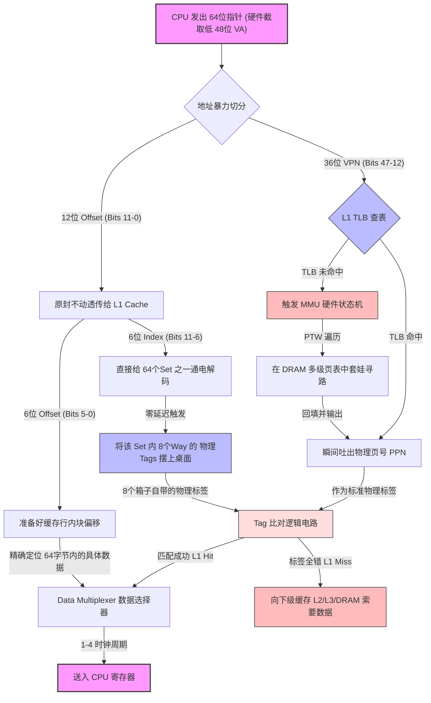

# 硬件组成

## 核心定义：代码即数据的“执行引擎”

现代存储程序式计算机（冯·诺依曼架构）的本质，是**将“死的数据”和“活的指令”扔进了同一个物理存储池（内存）中，并用一个极其纯粹的“计算引擎（CPU）”去无脑读取并执行。**

* **打破硬件写死的宿命**：在冯·诺依曼之前，要改变机器的功能需要重新插拔物理线缆（如埃尼阿克）。冯·诺依曼架构的伟大之处在于，控制计算逻辑的“程序”本身变成了可以被传输、修改甚至动态生成的“数据”。这就是为什么你能用 C++ 写一个 Python 解释器，再用 Python 写一段代码去动态生成并在内存里运行另一段汇编。
* **物理映射的极简主义**：
  * **执行引擎（CPU）**：只负责两件事——“算（ALU）”和“控制执行流（分支/跳转）”。它本身是个没有长期记忆的瞎子。
  * **状态容器（寄存器/内存）**：宇宙中的所有信息（不管是图片、文字，还是教 CPU 怎么做加法的机器码），在这里都众生平等，全部是二进制状态的物理载体。
  * **取指-执行周期（时钟心跳）**：晶振产生稳定的时钟周期，如同引擎的活塞运动，每跳动一次，CPU 就尝试从内存吸入一口“指令和数据”，处理完再将结果吐回内存。

    * **结构冲突的根源**：在经典冯·诺依曼架构中，每次心跳 CPU 都需通过同一条总线从内存获取内容——但取指令和取数据必须排队，不能同时进行，这就埋下了结构冲突（Structural Hazard）的隐患。

    * **L1 的分离（哈佛伪装）**：为了打破这种物理限制，现代 CPU 在 L1 层面将缓存物理劈开为 L1I（指令缓存）和 L1D（数据缓存）。因为指令是只读且规律顺序执行的，极度适合预取；而数据又读又写、访问模式随机跳跃（如遍历哈希表、链表），两者混居会导致缓存扰动、流水线断流。L1I 与 L1D 的分离，保证了每次心跳时，取指和取数在流水线入口处双管齐下，互不干扰。

    * **L2/L3 的统一（冯·诺依曼回归）**：然而，这种分离止步于 L1，往下的 L2/L3 重新回归统一缓存——因为程序的运行时需求动态变化，一段极短的 for 循环可能数据量极大而指令极少。统一缓存能将容量动态倾斜给当前最饥渴的一方，比如把 90% 的空间全塞满数据，空间利用率直接拉满；容量充足了，数据侧的缓存命中率自然水涨船高。若强行将 L2 对半切分为指令区和数据区，做矩阵运算时指令侧大半闲置，数据侧却因容量不足频频 Miss，整体命中率会被白白拖垮。

    * **核心洞见**：L1 的分离是为了让流水线跑得飞起来，L2/L3 的统一是为了让缓存用得像泥巴一样灵活——前者是物理的倔强，后者是哲学的回归。

这个架构的伟大造就了现代软件工业，但也亲手埋下了一个致命的隐患——引擎（CPU）的速度每两年翻一番，而油管（内存物理引脚）的宽度却十年难得一变。

### 冯·诺依曼瓶颈的现代演进：内存墙与通道争夺

现代多核架构下，CPU 与内存之间的带宽失衡被称为”内存墙（Memory Wall）”。由于前端总线（FSB）已被淘汰，内存控制器（IMC）被直接集成在 CPU 内部。此时，决定数据供给极限的不再是虚无缥缈的系统总线，而是 **CPU 支持的物理内存通道（Channel）数量**与通道频率。

我们可以通过一个供需模型与排队论，定量推导出多核系统何时会撞上这堵”墙”。将所有指标统一为：每秒字节数（Bytes/s）。

#### 供给侧（物理通道的绝对上限与概念澄清）

在计算物理供给带宽时，必须严防消费级市场的”概念劣化”，严格拆分以下两个独立层级：

1. **DIMM（双列直插内存模组 / 内存条实物）**：插在主板插槽上的硬件实体。其唯一核心作用是**扩充内存总容量**。容量的增加可以减少操作系统因内存不足而频繁将冷数据换出到硬盘 Swap 区的卡顿（即消除宏观缺页中断），但这与微观的”总线带宽提升”毫无关系。
2. **Channel（物理内存通道）**：CPU 内部独立的 64bit 传输总线。它决定了整机的最大供给带宽 $B_{\text{supply}}$，并且在排队论模型中直接对应**独立服务台的数量**。

**供给侧的真实计算式为：**

$$B_{\text{supply}} = N_{\text{channel}} \times B_{\text{per\\_channel}}$$

> **注：** $N_{\text{channel}}$ 由 CPU 架构与主板布线物理焊死，绝不随 DIMM 插入数量的无脑增加而改变。

#### 结合 M/D/N 排队模型的直观解剖

为了彻底打破”插几根条子就是几通道”的认知错觉，我们代入排队论模型进行微观透视：

* **场景 1：双通道主板，插 2 根 DIMM（A1+B1）**
* **架构**：2 条物理 Channel，对应 2 个物理 DIMM。
* **排队模型**：**M/D/2**（两套独立的 M/D/1 控制器并行处理 CPU 访存请求）。
* **供给带宽**： $B_{\text{supply}}$ = 2 × 单通道带宽。

* **场景 2：同一块双通道主板，插满 4 根 DIMM（A1A2+B1B2）**
* **架构**：依旧只有 2 条物理 Channel。通道 A 的总线上挂载了 A1、A2 两根 DIMM；通道 B 挂载了 B1、B2。
* **排队模型**：**仍然是 M/D/2**。
* **物理真相**：总带宽 $B_{\text{supply}}$ 完全不变！在相同的 CPU 读写负载下，通道利用率 $\rho$ 和微观访存排队延迟与”插 2 根时”一模一样。*(注：此时系统表现出的轻微顺滑，大多源于多 Rank 内存条的页交错优化带来的微弱行激活红利，以及容量翻倍消除了磁盘 Swap，绝非排队服务台 $c$ 增加了。)*

* **场景 3：工作站/服务器主板，插 4 根 DIMM（每条通道独立 1 根）**
* **架构**：真正的 4 条物理 Channel，对应 4 个物理 DIMM。
* **排队模型**：**M/D/4**。
* **供给带宽**： $B_{\text{supply}}$ = 4 × 单通道带宽。这才是真正通过增加服务台数量来拉升供给上限、推迟内存墙降临的物理手段。

> **DDR5 时代的补充**：单根 DDR5 DIMM 内部虽被拆分为两个 32bit 的子通道以提升并发效率，但对外依然只占用 CPU 的 1 条物理 64bit 通道，本质上仍属于单通道 M/D/1 系统。商业营销中所谓的”单根 DDR5 即双通道”，是进一步模糊了模组内部架构与 CPU 硬件总线的边界。

**需求侧（被缓存过滤后的真实饥渴）**：

CPU 核心的计算速度极快，如果每次运算都直接向内存要数据，只需半个核心就能抽干所有带宽。现代 CPU 之所以能堆出 64 核甚至 128 核，完全依赖于 L1/L2/L3 缓存的拦截。因此，真正的需求是核心在缓存未命中（Cache Miss）时向外发出的求救信号。

* 单核实际需求 = 单核极速吞吐量 $\times$ 最后一级缓存未命中率
* $$R_{\text{actual}} = R_{\text{core max}} \times M_{\text{rate}}$$

* 全村总需求 = 核心数 $\times$ 单核实际需求
* $$B_{\text{demand}} = N_{\text{CPU}} \times R_{\text{actual}}$$

**拐点条件：临界核数（The Critical Core Count）**

当 $B_{\text{demand}} > B_{\text{supply}}$ 时，系统撞上内存墙。所有核心被迫在内存通道外排队，CPU 利用率暴跌。令供需相等，我们可以解出当前架构最多能喂饱多少个核心：

$$N_{\text{CPU}} \times R_{\text{actual}} = B_{\text{supply}}$$

$$\boxed{N_{\text{critical}} = \frac{B_{\text{supply}}}{R_{\text{core max}} \times M_{\text{rate}}}}$$

**自然语言洞察**：

1. **为什么增加核心数会”白给”？**
如果你的算法导致频繁的 Cache Miss（ $M_{\text{rate}}$ 偏高），真实需求会瞬间穿透缓存，填满物理内存通道（ $B_{\text{supply}}$）。此时超过 $N_{\text{critical}}$ 的核心不仅无法加速，反而会引发严重的通道拥堵（Traffic Jam），导致整体性能倒退。
2. **破局的两条绝路**：
从公式可以看出，想要支持更多的核心（提高 $N_{\text{critical}}$），只有两个物理手段：
* **做大分子（堆硬件）**：增加服务器的物理内存通道数（ $N_{\text{channel}}$），这也是为什么高端服务器 CPU（如 AMD EPYC）会配备夸张的 12 通道 DDR5——**注意是增加通道数，不是无脑加内存条**。
* **做小分母（改代码）**：优化代码的空间局部性，将缓存未命中率（ $M_{\text{rate}}$）无限压低至趋近于 0。只要数据不出 L3 缓存，就不消耗外部内存带宽，核心数就可以尽情扩展。

---

### 从 AMAT 看"内存墙"：延迟模型与带宽模型的统一

上一节用纯粹的带宽供需模型推导了临界核数，下一节将展开 AMAT 延迟模型。本节在这两者之间架一座桥：**为什么延迟模型（AMAT）和带宽模型（内存墙）描述的是同一物理过程，以及如何用 AMAT 的视角重新理解内存墙。**

#### 一、内部与外部的"带宽次元壁"

回顾下一节 AMAT 的递推式（视角一：按动作记账）：

$$T_1 = \underbrace{\ell_1}_{\text{必然敲L1}} + \underbrace{M_1 \ell_2}_{\text{可能敲L2}} + \underbrace{M_1 M_2 \ell_3}_{\text{可能敲L3}} + \underbrace{M_1 M_2 M_3 \ell_{\text{mem}}}_{\text{可能敲主存}}$$

前三个动作（敲 L1、L2、L3）都发生在 CPU 芯片内部（On-die）。最后一步（敲主存）发生在 CPU 芯片外部（Off-chip）。

**CPU 内部是"不差钱"的**：L1/L2/L3 缓存通过芯片内部密密麻麻的硅连线（SRAM）实现，带宽高得离谱（通常在几 TB/s 到十几 TB/s）。无论核心怎么折腾，L1/L2/L3 的门槛都被内部总线轻易踏平，几乎不存在"带宽不够导致塞车"的情况。

**CPU 外部是"要命的独木桥"**：一旦请求突破了 L3，就需要离开 CPU 封装，走主板上的物理铜线去访问远端的 DRAM 内存条。这条路的带宽受限于物理引脚数量，极其昂贵和稀缺（几十到一百多 GB/s）。

这就是为什么在计算"系统什么时候撞上内存墙"时，我们根本不关心 L1 和 L2 的未命中率有多高——那都是 CPU 内部的"家务事"，内部带宽完全兜得住。

真正消耗稀缺外部物理内存通道带宽的，只有公式中的最后一项：连 L3 都找不到数据，被迫去敲主存门的那些请求。

#### 二、"漏斗"机制：最后一层未命中率就是 $M_1 M_2 M_3$

到达最后一步的概率是多少？从递推式直接读出：

$$P_{\text{外部请求}} = M_1 \times M_2 \times M_3$$

这就是上一节内存墙公式中的 $M_{\text{rate}}$ ——它不是 L3 单独的本地未命中率，而是**全局最后一层未命中率（Global LLC Miss Rate）**，即请求从 L1 出发、一路穿透 L1、L2、L3 三道防线、最终泄漏到外部总线的概率。

因此，内存墙公式可以更精确地写为：

$$\boxed{N_{\text{critical}} = \frac{B_{\text{supply}}}{R_{\text{core max}} \times M_1 M_2 M_3}}$$

多级缓存的本质，就是一个极其强大的**带宽过滤器（漏斗）**。如果单核全速运行产生 100 GB/s 的读写需求：

- L1 拦住 90%（ $M_1 = 10\\%$）
- L2 拦住剩下的 80%（ $M_2 = 20\\%$） 
- L3 再拦住剩下的 50%（ $M_3 = 50\\%$）

那么最终泄漏到主板内存通道的真实带宽需求只有：

$$100\ \text{GB/s} \times 0.1 \times 0.2 \times 0.5 = 1\ \text{GB/s}$$

此时，哪怕主板只有 50 GB/s 的总内存带宽，也能轻松支撑 50 个核心同时满载。

但如果代码写得极差（比如完全随机访问大数组，跳过了所有缓存的预取），导致 $M_1 M_2 M_3$ 乘积变成了 $20\\%$，那单核就会向外索要 20 GB/s 的带宽，仅仅 3 个核心就能把内存通道彻底挤爆。

> **漏斗思维的核心**：缓存层级的价值不在于"让数据更快地被找到"（这是延迟视角），而在于"让绝大多数请求在到达外部总线之前就被拦截"（这是带宽视角）。每一层缓存都是一个滤网，三层滤网串联后，最终漏出去的请求量被压缩了几个数量级。

#### 三、AMAT 与内存墙的统一：延迟和带宽是同一枚硬币的两面

AMAT 计算的是"平均每次访存要等多久"（延迟），内存墙计算的是"所有核心加起来每秒向内存要多少数据"（带宽）。它们是同一个物理过程的两种度量，而且存在一个**双向反馈循环**。

**3.1 AMAT 公式里已经藏了带宽信息**

把递推式按"是否消耗外部带宽"重新分组：

$$T_1 = \underbrace{(\ell_1 + M_1 \ell_2 + M_1 M_2 \ell_3)}_{\text{全部在芯片内部，零外部带宽消耗}} + \underbrace{M_1 M_2 M_3 \cdot \ell_{\text{mem}}}_{\text{穿过漏斗的请求，消耗外部带宽}}$$

前半段（L1/L2/L3 的敲门成本）不消耗任何外部内存带宽。只有最后一项 $M_1 M_2 M_3 \cdot \ell_{\text{mem}}$ 既贡献了延迟惩罚（~220 周期），又消耗了外部带宽（每次访问搬运 64 字节的 Cache Line）。

**3.2 $\ell_{\text{mem}}$ 不是常数——排队论的关键修正**

AMAT 模型默认 $\ell_{\text{mem}}$ 是一个固定值（比如 100ns 或 220 周期）。这个假设在系统轻载时成立——内存控制器门前没有排队，请求即到即处理。

但当 $B_{\text{demand}}$ 逼近 $B_{\text{supply}}$ 时，每个物理 Channel 的服务台前都开始形成请求队列。如上一节所述， $N_{\text{channel}}$ 个 Channel 构成 M/D/ $N_{\text{channel}}$ 系统；在地址交错（Interleaving）的合理负载均衡下，各通道的请求到达率均等，因此单通道的 M/D/1 排队公式直接适用于整个系统。实际的内存访问延迟为：

$$\ell_{\text{mem}}^{\text{effective}} = \ell_{\text{mem}}^{\text{base}} \times \left(1 + \frac{\rho}{2(1 - \rho)}\right)$$

其中 $\rho = \frac{B_{\text{demand}}}{B_{\text{supply}}} = \frac{B_{\text{demand}}}{N_{\text{channel}} \times B_{\text{per-channel}}} = \frac{N_{\text{CPU}}}{N_{\text{critical}}}$ 是**每个物理内存通道**的利用率（M/D/N 系统中单个服务台的负载因子）。注意：插更多 DIMM 不会改变 $N_{\text{channel}}$ ，因此 $\rho$ 不降——增加容量消除的是 Swap 卡顿，不是排队延迟。

- 当 $\rho = 0.1$ （10% 利用率）： $\ell_{\text{mem}}^{\text{effective}} \approx 1.06 \times \ell_{\text{mem}}^{\text{base}}$，几乎无影响
- 当 $\rho = 0.5$ （50% 利用率）： $\ell_{\text{mem}}^{\text{effective}} \approx 1.5 \times \ell_{\text{mem}}^{\text{base}}$，开始感知
- 当 $\rho = 0.9$ （90% 利用率）： $\ell_{\text{mem}}^{\text{effective}} \approx 5.5 \times \ell_{\text{mem}}^{\text{base}}$，延迟暴涨
- 当 $\rho \to 1$： $\ell_{\text{mem}}^{\text{effective}} \to \infty$，系统实质上瘫痪

**3.3 恶循环：延迟恶化与带宽饱和的相互放大**

这里存在一个隐蔽的正反馈：

1. 核心数增加 → $B_{\text{demand}}$ 上升 → $\rho$ 上升
2. $\rho$ 上升 → $\ell_{\text{mem}}^{\text{effective}}$ 因排队而增加
3. $\ell_{\text{mem}}^{\text{effective}}$ 增加 → AMAT 增加 → 核心的 IPC（每周期指令数）因等内存而下降
4. IPC 下降意味着核心在空转——但 Load/Store 指令的发射速率未必等比例下降，有效带宽需求甚至可能因流水线断流后的指令重放而进一步恶化

结果：系统撞墙的实际拐点比简单公式 $N_{\text{critical}}$ 预测的**更早、更剧烈**。这不是一个平缓的"到达上限后性能停滞"，而是一个"过了某个点后性能断崖式暴跌"的过程。根因就是 $\frac{1}{1-\rho}$ 在 $\rho$ 接近 1 时的超线性发散。

**3.4 修正后的统一模型**

将排队效应纳入 AMAT，得到一个自洽方程：

$$T_1^{\text{loaded}} = \ell_1 + M_1 \ell_2 + M_1 M_2 \ell_3 + M_1 M_2 M_3 \cdot \ell_{\text{mem}}^{\text{base}} \cdot \left(1 + \frac{\rho}{2(1 - \rho)}\right)$$

其中 $\rho = \frac{N_{\text{CPU}} \times M_1 M_2 M_3 \times 64}{B_{\text{supply}} \times T_1^{\text{loaded}}}$。

这个方程将 AMAT（延迟模型）和内存墙（带宽模型）彻底统一：延迟不再是静态参数，而是系统负载的函数；带宽饱和通过排队延迟反哺到延迟中，延迟增加又影响有效吞吐。 $\rho$ 同时出现在等式两边——这是体系结构中延迟与带宽互为因果的数学表达。

#### 四、工程启示：为什么优化缓存命中率是"一箭三雕"

从统一模型可以得出一个深刻结论：**降低 $M_1 M_2 M_3$ 的收益是超线性的**。

1. **直接降低 AMAT**：漏斗更紧， $M_1 M_2 M_3 \cdot \ell_{\text{mem}}$ 项的权重减小，平均访存时间缩短。
2. **直接降低带宽需求**： $B_{\text{demand}}$ 等比例下降， $\rho$ 降低，更多核心可以同时满载。
3. **间接降低排队延迟**： $\rho$ 降低后， $\frac{1}{1-\rho}$ 因子减小， $\ell_{\text{mem}}^{\text{effective}}$ 自己也在变小。

举个例子：将 $M_1 M_2 M_3$ 从 1% 优化到 0.1%（提高一个数量级——比如通过分块矩阵乘法替代朴素三重循环）：

- 第一层收益：AMAT 中的 $\ell_{\text{mem}}$ 项贡献从 2.2 周期降到 0.22 周期（假设 $\ell_{\text{mem}} = 220$）
- 第二层收益： $B_{\text{demand}}$ 降为原来的 1/10， $\rho$ 从 0.8 降到 0.08
- 第三层收益：排队延迟因子从 ~2.5× 降到 ~1.04×， $\ell_{\text{mem}}^{\text{effective}}$ 自身从 550 周期降到 ~229 周期

三层叠加的总收益远超直觉上"延迟减少了 10×"的线性预期。这就是为什么算法层面的缓存优化（空间局部性、分块、预取）在实际工程中往往比堆硬件通道更有效——它的收益是**非线性放大**的。

> **一句话总结**：内存墙公式告诉你"最多能跑几个核"，AMAT 告诉你"每个核跑得有多快"，而这节证明了两者不是独立的——AMAT 里的 $\ell_{\text{mem}}$ 本身就是系统负载的函数。优化缓存命中率（缩小 $M_1 M_2 M_3$），同时推高了天花板（ $N_{\text{critical}}$ 增大）并降低了每个人的等待时间（ $T_1$ 减小），还削弱了排队恶循环的触发条件——这就是缓存命中率在体系结构中的核心地位。

---

### 局部性原理的缓存命中率模型（AMAT）

程序的时间局部性（Temporal Locality）和空间局部性（Spatial Locality）决定了缓存效率。本节采用平均内存访问时间(Average Memory Access Time，AMAT)模型，用"敲门与开门"的比喻来清晰区分两种本质不同的量。

---

#### 一、核心概念：增量延迟（Incremental Latency）与"敲门成本"

访问某一层 Cache 时，无论最终是否命中，访问动作本身就要消耗时间。在体系结构中，**敲门成本**的真实物理含义是：**访问该层 Cache 必须完成的所有硬件前置与读取动作。** 无论是 Hit 还是 Miss，这扇门你都必须先敲，成本必定发生。

以 L1 为例，一次访问的完整"敲门"动作包含：

```
地址解码（Address Decode）
    ├── 虚拟地址 → 物理地址（TLB 并发查询；若 TLB 未命中，还需查页表）
    ├── Index 位提取（来自虚拟地址，VIPT 方式）→ 选中目标 Set
    └── Tag 位提取（来自物理地址）→ 与 Tag Array 比对
数据读取（Data Array Access）
    └── 命中后，根据 Offset 取出目标字节 → 返回 CPU
```

**敲门成本的"层级递减"特性：**

进入 L2 甚至更深层级时，不需要再像 L1 那样做繁重的虚拟地址翻译（TLB）。因为在 L1 阶段，物理地址已经获取完毕。L2 拿到物理地址后，直接提取物理 Index 和 Tag 进行比对。

> 结论：每一层的敲门成本 $\ell_i$ 都是该层**独有的、纯粹的硬件动作耗时**。

| 符号 | 含义 | 物理图像 |
|------|------|----------|
| $T_i$ | 从第 $i$ 层出发的 AMAT | CPU 感受到的平均访存时间；递归定义： $T_i = \ell_i + M_i \cdot T_{i+1}$ |
| $\ell_i$ | 第 $i$ 层增量延迟（敲门成本） | 只要你向第 $i$ 层发起了访问，就**必定付出**的过路费 |
| $L_i$ | 第 $i$ 层总命中时间 | 从 CPU 出发，一路过关斩将直到在第 $i$ 层拿到数据，**累计付出的总时间**（ $\ell_1 + \ell_2 + \cdots + \ell_i$） |
| $M_i$ | 第 $i$ 层局部未命中率 | 到了第 $i$ 层却吃闭门羹，被迫继续向下的概率 |
| $H_i$ | 第 $i$ 层局部命中率 | $1 - M_i$，在第 $i$ 层成功拿到数据并终止旅程的概率 |

---

#### 二、计算 AMAT 的两种等效视角：算的是同一笔账

把整个存储层级（L1 → L2 → L3 → 主存）看作一个整体时，如何计算平均访存时间？这里存在两种在物理和数学上**完全等价**的建模视角，它们的区别仅仅是**"记账方式"不同**。

> **核心比喻**：递推式是"按经过的收费站（动作）记账"，概率加权式是"按最终到达的目的地（位置）记账"。两者算的是同一笔物理账单，所以必然等价。

##### 视角一：按"动作"记账（增量延迟/递推式）

**核心逻辑：既然每次向下访问都必定付出当前层的敲门成本，那就把必然发生的时间提取出来。**

- 敲 L1 的门是 100% 发生的，直接记账 $\ell_1$。
- 只有在 L1 Miss 时（概率 $M_1$），才会去敲 L2 的门，记账 $M_1 \ell_2$。
- 只有在 L1 和 L2 都 Miss 时（概率 $M_1 M_2$），才会去敲 L3 的门，记账 $M_1 M_2 \ell_3$。

$$
T_1 = \underbrace{\ell_1}_{\text{必然敲L1}} + \underbrace{M_1 \ell_2}_{\text{可能敲L2}} + \underbrace{M_1 M_2 \ell_3}_{\text{可能敲L3}} + \underbrace{M_1 M_2 M_3 \ell_{\text{mem}}}_{\text{可能敲主存}}
$$

> **关键点**：敲门成本 $\ell_i$ 前面乘的不是命中率，而是**到达这一层的概率**。只要到达，就必须付钱。

##### 视角二：按"终点"记账（全局命中/概率加权式）

**核心逻辑：追问数据最终到底在哪一层被找到（互斥事件），然后乘以到达该终点所付出的"累计总时间"。**

要在第 $i$ 层命中，必须先敲过前面所有的门。因此"总命中时间"是敲门到该层为止的**累计时间**：

$$
L_1 = \ell_1, \quad L_2 = \ell_1 + \ell_2, \quad L_3 = \ell_1 + \ell_2 + \ell_3, \quad L_{\text{mem}} = \ell_1 + \ell_2 + \ell_3 + \ell_{\text{mem}}
$$

在第 $i$ 层命中 = 敲过所有前面的门，被第 $i$ 层开门：

$$
T_1 = \underbrace{H_1 L_1}_{\text{终点是L1}} + \underbrace{M_1 H_2 L_2}_{\text{终点是L2}} + \underbrace{M_1 M_2 H_3 L_3}_{\text{终点是L3}} + \underbrace{M_1 M_2 M_3 L_{\text{mem}}}_{\text{终点是主存}}
$$

展开含义（按概率从高到低）：

- $H_1 L_1$：数据在 L1 被找到（概率 $H_1$，耗时 $L_1 = \ell_1$）
- $M_1 H_2 L_2$：数据在 L2 被找到（概率 $M_1 H_2$，耗时 $L_2 = \ell_1 + \ell_2$）
- $M_1 M_2 H_3 L_3$：数据在 L3 被找到（概率 $M_1 M_2 H_3$，耗时 $L_3$）
- $M_1 M_2 M_3 L_{\text{mem}}$：数据在主存被找到（概率 $M_1 M_2 M_3$，耗时 $L_{\text{mem}}$）

---

#### 三、为什么它们完全等价？（代数证明）

很多初学者误以为"把内存看作整体时，只能用概率加权式"。这是思维误区。我们将"视角二（概率加权）"彻底展开，按 $\ell_i$ 重新合并同类项，看看每一笔"过路费"到底向谁收了：

$$
\text{对于 } \ell_1: \underbrace{H_1}_{1-M_1} + \underbrace{M_1 H_2}_{M_1(1-M_2)} + \underbrace{M_1 M_2 H_3}_{M_1 M_2(1-M_3)} + \underbrace{M_1 M_2 M_3}_{\text{去主存的人}} = 1
$$

*含义：不管你在哪层找到数据，所有人都得付 L1 的敲门费，系数为 1*

$$
\text{对于 } \ell_2: \underbrace{M_1 H_2}_{M_1(1-M_2)} + \underbrace{M_1 M_2 H_3}_{M_1 M_2(1-M_3)} + \underbrace{M_1 M_2 M_3}_{\text{去主存的人}} = M_1
$$

*含义：只有经过 L1 未命中的那部分人，才需要付 L2 的敲门费，系数为* $M_1$

$$
\text{对于 } \ell_3: \underbrace{M_1 M_2 H_3}_{M_1 M_2(1-M_3)} + \underbrace{M_1 M_2 M_3}_{\text{去主存的人}} = M_1 M_2
$$

*含义：只有经过 L1/L2 未命中的那部分人，才需要付 L3 的敲门费，系数为* $M_1 M_2$

数学上完美闭环：

$$
\boxed{\text{概率加权式的展开结果} \equiv \ell_1 + M_1 \ell_2 + M_1 M_2 \ell_3 + M_1 M_2 M_3 \ell_{\text{mem}} \equiv \text{递推式}}
$$

---

#### 四、直观的数据实例验证

设典型 x86-64（如 AMD Zen 3）架构参数：

- 敲门费（增量延迟）： $\ell_1 = 4$ 周期， $\ell_2 = 12$ 周期， $\ell_3 = 40$ 周期， $\ell_{\text{mem}} = 220$ 周期。
- 累计耗时（总时间）： $L_1 = 4$， $L_2 = 16$， $L_3 = 56$， $L_{\text{mem}} = 276$。
- 未命中率： $M_1 = 0.05$， $M_2 = 0.10$， $M_3 = 0.20$。

**用递推式计算（极速版）**：

$$
T_1 = 4 + (0.05 \times 12) + (0.005 \times 40) + (0.001 \times 220) = \mathbf{5.02 \text{ 周期}}
$$

**用概率式计算（追踪终点版）**：

- L1 命中（终点 L1）：概率 $0.95$，耗时 4 → $0.95 \times 4 = 3.80$
- L2 命中（终点 L2）：概率 $0.05 \times 0.90 = 0.045$，耗时 16 → $0.045 \times 16 = 0.72$
- L3 命中（终点 L3）：概率 $0.05 \times 0.10 \times 0.80 = 0.004$，耗时 56 → $0.004 \times 56 = 0.224$
- 去往主存（终点 Mem）：概率 $0.05 \times 0.10 \times 0.20 = 0.001$，耗时 276 → $0.001 \times 276 = 0.276$
- **合计**： $3.80 + 0.72 + 0.224 + 0.276 = \mathbf{5.02 \text{ 周期}}$

**缓存层级访问流程（视角一）**：

```
L1 --> ℓ_1 = 4       (100% 到达)
  \ miss (5%)
   L2 --> ℓ_2 = 12    (5% 到达)
     \ miss (10%)
      L3 --> ℓ_3 = 40 (0.5% 到达)
        \ miss (20%)
         DRAM --> ℓ_mem = 220 (0.1% 到达)
```

#### 五、两种等效视角的比较与工程指导

不存在"把内存看作整体时不能用递推式"的说法，它们是同一条物理真理的一体两面。在实际工程中，两者的应用场景各有侧重：

| 视角 | 物理思维 | 数学特征 | 工程用途 |
|------|----------|----------|----------|
| **递推式**（增量延迟） | 流水线思维（看路径）：关注每一次跨越层级的动作成本 | 提取公因式，极其精简 | **硬件架构师最爱。** 方便快速心算，用来评估某条互连总线或某级缓存设计的延迟红利 |
| **概率加权式**（全局命中） | 分布思维（看位置）：关注数据最终驻留在哪里 | 全概率公式，互斥展开 | **软件/性能调优工程师最爱。** 直观展示各个层级对访存时间的"贡献占比"，一眼看出性能瓶颈究竟在哪一层 |

> **直击本质的一句话**：递推式是"按经过的收费站（动作）记账"，概率加权式是"按最终到达的目的地（位置）记账"——同一笔账单，两种数法。

等价性的代数证明见**第三节**。

#### 六、寻址机制：地址是如何被"肢解"的？

程序发出虚拟地址（Virtual Address, VA），MMU 将其翻译为物理地址（Physical Address, PA），缓存控制器再将 PA 精确地切分为三段：tag、index、offset。  
其中：  
offset：决定在 1 条 cache line（例如 64B）中的具体字节位置  
index：决定访问哪一个 set（组）  
tag：决定该 set 中哪一条 cache line 才是你要的那条（用于命中判断）

**打工人比喻体系**（配合 AMAT 敲门模型理解）：

| 硬件单元 | 比喻角色 | 说明 |
|----------|----------|------|
| 算术逻辑单元(Arithmetic Logic Unit，ALU) | 超级打工人 | 手速极快，但被焊在工位上，只处理手里的数据 |
| 寄存器（Registers） | 打工人的双手 | 真正发生计算的地方，容量极小（64 位 × 几个寄存器） |
| L1 缓存 | 办公桌面 | 极快（3-4 周期），CPU 核私有；分 L1i（指令）和 L1d（数据） |
| L2 缓存 | 办公桌下抽屉 | 较快（12 周期左右），CPU 核私有 |
| L3 缓存 | 部门公共档案室 | 较慢（40 周期），同 CCX 多核共享；也是 L2 淘汰文件的"受害者缓存" |
| 主存（DRAM） | 公司总部大仓库 | 慢（200+ 周期），海量（16GB+） |
| SSD / HDD | 外部物流中转站 | 极慢，数据永久保存地 |
| 操作系统 & MMU | 安保部与物流调度 | VA→PA 翻译，页面置换调度 |

**关键物流单位**：

| 单位 | 大小 | 说明（物流隐喻与物理实质） |
|------|------|------|
| 字 / 字节 (Word/Byte) | 1~8 字节（现代 64 位 CPU 通常为 8 字节） | "打工人手里的'单件物品'。这是 ALU (算术逻辑单元) 和寄存器真正能够吞吐、计算的精确颗粒度。无论 Cache 搬来多大的货箱，数据通过 MUX (多路复用器) 从货箱中精准'夹取'这 4 字节（int）或 8 字节（long），放入寄存器（双手），ALU (超级打工人) 再从寄存器中取出数据进行计算。" |
| 缓存行 (Cache Line) | 固定 64 字节 | "标准化集装箱"。硬件层面的最小搬运单位。出于空间局部性（买一送多），哪怕程序只声明读取 1 个字节的 char，内存控制器也会雷打不动地打包相邻的 64 字节，装进集装箱送往 L1 Cache。 |
| 内存页 (Page) | 通常 4KB | "重型货柜"。操作系统 (OS) 管理内存的最小基本盘。当发生缺页中断时，DMA 自动搬运车会一次性将整个 4KB 的货柜从硬盘 Swap 区拉入物理内存 (DRAM)。 |

**寄存器分类：通用寄存器 vs 向量寄存器**

CPU 中的"双手"其实有两副手套，分工不同。要理解向量寄存器，必须先区分三个层级的概念：

> **SIMD 不是某一套具体指令，而是一种计算思想。** SIMD (Single Instruction, Multiple Data，单指令流多数据流) 是 Flynn 分类法定义的架构范式——一条指令同时操作多个数据。如果说标量运算 (SISD) 是"厨师一刀切一个土豆"，SIMD 就是"厨师换了大铡刀，一刀同时切碎 4、8 甚至 16 个土豆"。SSE、AVX、AVX-512 以及 ARM 的 NEON、SVE，全都是 SIMD 思想的具体实现产品。

**x86 SIMD 进化家族谱**：

| 时代 | 指令集（操作指令） | 硬件寄存器（数据容器） | 宽度 | 单次可装 32-bit 浮点数 |
|------|-------------------|----------------------|------|------------------------|
| 萌芽期 (1997) | MMX | MM 寄存器（复用 FPU） | 64-bit | 仅整数 |
| 第一代 (1999) | SSE / SSE2 / SSE3 / SSE4 | **XMM** | 128-bit | 4 个 |
| 第二代 (2011) | AVX / AVX2 | **YMM** | 256-bit | 8 个 |
| 第三代 (2017) | AVX-512 | **ZMM** | 512-bit | 16 个 |

> **认知模型**：SIMD = 总体指导思想（批量操作）；SSE / AVX / AVX-512 = 具体指令标准（动词/控制器）；XMM / YMM / ZMM = 硬件存储载体（名词/数据容器）。

回到两副手套的对比：

| 类型 | x86-64 典型数量 | 宽度 | 职责 |
|------|----------------|------|------|
| 通用寄存器 (GPR) | 16 个 (RAX, RBX, ...) | 64 位 | 整数运算、地址计算、分支判断——日常主力 |
| 向量寄存器 | 16 个 (XMM0-XMM15)，AVX-512 下 32 个 (ZMM0-ZMM31) | 128~512 位 | 批量浮点、数据并行——SIMD 专用 |

**如何选择 GPR 还是向量寄存器**：编译器和程序员都可以决定。

- **编译器自动选**：写 `float a = b + c`，编译器默认生成 GPR 标量指令；写循环累加数组，在 `-O2` / `-O3` 下编译器尝试**自动向量化**——将循环体展开为 SIMD 指令，数据装入向量寄存器。自动向量化条件苛刻：循环体内无跨迭代依赖、数组内存对齐、仅支持简单运算才触发。

> 判断数组内存对齐，核心是看起始地址能否被 16、32 或 64 整除。在十六进制逻辑里， $100_{16}$ （即十进制 256）天然是 $10_{16}$ (16)、 $20_{16}$ (32) 和 $40_{16}$ (64) 的完美倍数，这三者刚好对应 $10_{16}$ 的 1 倍、2 倍和 4 倍。由于 16 字节在十六进制下就是 $10_{16}$，所以除以 16 就相当于让这个十六进制数直接"右移"一位。基于这个移位特性，对齐判断变得极其直观：只要地址末位为 `0`（满足右移条件），就是 16 字节对齐（如 `0x1010`）；在末位为 `0` 的前提下，如果倒数第二位是 2 的倍数（偶数），就是 32 字节对齐（如 `0x1020`）；如果是 4 的倍数，则是 64 字节对齐（如 `0x1040`）。

- **程序员手动选**：通过 Intrinsics（`_mm_add_ps` → SSE/XMM，`_mm256_add_ps` → AVX/YMM，`_mm512_add_ps` → AVX-512/ZMM）或内联汇编精确绑定目标寄存器，用于矩阵乘法、视频编解码、深度学习推理等性能关键路径。AVX-512 还引入了**掩码机制**（Masking）——可以指定"只更新 16 个位置中的第 2、5、8 个"，这让向量计算的灵活性有了质的飞跃。

**数量与容量比例**：
- 寄存器个数：GPR 与向量寄存器数量接近（16:16 或 16:32，取决于 AVX-512）
- 总比特容量：向量寄存器远超 GPR——32 × 512 bits vs 16 × 64 bits ≈ 16 倍
- 指令占比：通用代码中 ≥ 90% 指令操作 GPR（控制流、地址计算、标量运算）；数值热点中 SIMD 指令可占 30%+。

**VIPT 机制：L1 缓存的"跨时空并行"奇迹**

通常，必须等 MMU/TLB 把 VA 翻译成 PA 后才能查缓存（即 PIPT，用于 L2/L3）。但这太慢了。为了追求极致的 $\ell_1$ 敲门速度，L1 Cache 采用了 VIPT (Virtually Indexed, Physically Tagged) 技术：用虚拟地址找组（快），用物理地址比对标签（准）。理解 VIPT 的关键，在于搞清**页（Page）**和**缓存行（Cache Line）**之间的那条数学纽带。

**前置基础：页是 VA 和 PA 共同的管理单位**

现代操作系统的内存管理基本单位是页（Page），标准大小为 4KB（即 $2^{12} = 4096$ 字节）。当 MMU 把 VA 翻译成 PA 时，地址被严格劈成两半：

- **高位（Page Number，页号）**：VA 和 PA **不同**。CPU 需通过 TLB 查表，将虚拟页号翻译为物理页号。
- **低位（Page Offset，页内偏移）**：低 12 位。VA 和 PA 中**完全相同**，在翻译过程中原封不动。

$$
\text{VA} = \underbrace{\text{VPN}}_{\text{虚拟页号，需翻译}} \mid \underbrace{\text{Page Offset}}_{\text{低 12 位，不变}}
\qquad
\text{PA} = \underbrace{\text{PPN}}_{\text{物理页号，翻译结果}} \mid \underbrace{\text{Page Offset}}_{\text{低 12 位，不变}}
$$

**关键推论：这不变的 12 位，就是 VIPT 并行的物理根基。** 因为 Index 全在这 12 位里，所以用 VA 直接寻址完全不会出错。

**地址三段切分：Offset → Index → Tag**

在 4KB 分页和 64 字节 Cache Line 的标准系统中，这 12 位页内偏移被精确地掰成两段：

| 地址段 | 对应 Bit 位 | 位数 | 作用 |
|--------|-------------|------|------|
| Block Offset（块内偏移） | Bit 0~5 | 6 位 | 在 64 字节缓存行内定位具体字节（ $2^6 = 64$） |
| Set Index（组索引） | Bit 6~11 | 6 位 | 在 64 个 Set 中选中一个（ $2^6 = 64$） |
| Tag（标签） | Bit 12 及以上 | 剩余高位 | 与 Set 内各 Way 的 Tag 比对，确认是否命中 |

**一条优美的底层算术题**：

$$
\underbrace{64 \text{ Sets}}_{2^6} \times \underbrace{64\text{ Bytes/Line}}_{2^6} = 4096\text{ Bytes} = \underbrace{4\text{KB}}_{2^{12}}
$$

一个页（4KB）正好等于 64 个 Set × 64 字节/缓存行。**这不是巧合，而是刻意设计：** CPU 用页内偏移的 12 位恰好榨干了一个页的全部空间——低 6 位在行内找字节，高 6 位在 64 个 Set 中选组。

**为什么 L1 恰好卡在 64 个 Set？不能更多吗？**

如果能设计 128 个 Set（需要 7 位 Index），查 Set 时就需要用到 **Bit 12**。但 Bit 12 属于页号部分——VA 和 PA 在此处**不同**！这意味着：

> CPU 必须等 TLB 翻译完 VA，拿到 PA 的 Bit 12，才能确定去哪个 Set。**Index 寻址和 Tag 翻译的并行性被彻底摧毁**，L1 延迟暴增， $\ell_1$ 不再是 4 周期。

因此 64 个 Set 是 4KB 分页下的**物理上限**。这正是市面上大量 CPU 的 L1 数据缓存被定格在 32KB（64 Sets × 8 Ways × 64 Bytes = 32KB）的数学根本原因。

**VIPT 查询流程：三级递进**

用 Markdown 的 `mermaid` 语法来绘制流程图，不仅能清晰地展现这种硬件级别的高并发、多管齐下的时序，而且可以直接复制到各种笔记软件（如 Obsidian、Notion 或 GitHub）里完美渲染。


### 为什么这张图更符合真实的 VIPT？

1. **彻底分离了 Index 与 Tag 的时序**：图里清晰地展示了，低 12 位（Bits 11-0）不需要等待任何翻译结果，在发出地址的瞬间就已经去激活 L1 Cache 的物理电路（64 个 Set）了。
2. **汇合点在 Tag 比较器**：TLB 吐出来的 PPN 并没有去“拼凑”地址，而是作为“裁判标准”，去和右边提前捞出来的 8 个 Way 的物理标签进行并发比对。
3. **解释了并行的本质**：你可以清晰地看到走VPN到PPN的翻译和Index直接通电寻组是**完全并行的两条硬件流水线**。在物理标签交汇的那一刻，VIPT 的威力才真正显现。

**软件与硬件最完美的握手**：

整个流程的精妙之处在于：操作系统的 **4KB 分页** 给了地址 12 位"不变区"；硬件设计者将 L1 严格限制为 **64 个 Set + 64 字节缓存行**，恰好将这 12 位榨干（ $64 \times 64 = 4096$ ）。结果就是：CPU 在 TLB 翻译高位地址的同时，已经用 VA 的低 12 位找到了目标 Set——Index 寻址和 Tag 翻译完全并行，这就是 VIPT 的"跨时空并行"。

**Cache Line 的内部结构：数据是如何被夹取的**

Cache Line 是 64 字节的"集装箱"，命中后数据从 L1 Data Array 送出：

```
L1 Data Array 输出的 64 字节缓存行：
┌────────┬────────┬────────┬─────────┬────────┬────────┬─────────┬────────┐
│ Byte 0 │ Byte 1 │ Byte 2 │ ...     │ Byte 6 │ Byte 7 │ ...     │Byte 63 │
└────────┴────────┴────────┴─────────┴────────┴────────┴─────────┴────────┘
          ↑ Offset (Bit 0~5) 精确定位     ↑ MUX 夹取
                                           │
                              ┌────────────┴────────────┐
                              │  若程序读 int (4字节)：  │
                              │  MUX 从偏移位置夹取连续4字节 │
                              │  若程序读 long (8字节)：  │
                              │  MUX 从偏移位置夹取连续8字节 │
                              └────────────┬────────────┘
                                           ▼
                                    放入寄存器（双手）
                                           ▼
                                    ALU (超级打工人) 计算
```

- **Offset（6 位）**：从 VA/PA 低位提取，精准定位 64 字节集装箱内的目标字节起始位置。
- **MUX（多路复用器）**：根据程序指令类型（int/long），从缓存行中夹取连续 4 字节或 8 字节，送入寄存器。
- **寄存器 → ALU**：数据就位后，ALU 才能真正开始计算。

> **为什么不全部用 VA**：L2 及以下层级必须用 PA 才能保证跨核一致性；L1 用 VIPT 是利用页内偏移不改变这一特性，在 TLB 查询同时并行做 Index 寻址。

### 七、`arr[0]++` 的微观全景工作流

以 Core 0 执行 `arr[0]++` 为例，完整追踪数据在层级间的流转与淘汰过程。

**步骤 1：发号施令与并行的 L1/TLB 查阅**

CPU 发出 `arr[0]` 的虚拟地址（Virtual Address, VA）。现代主流 CPU 的 L1 缓存通常采用 VIPT 机制，此时寻址兵分两路、并行展开：

* **缓存组定位：** 硬件直接截取 VA 中的组索引（Set Index），径直走向 L1 的对应组（例如 Set 5）。
* **TLB 翻译：** 同时，VA 的页号被送往 TLB（Translation Lookaside Buffer）。**TLB 并非完整的内存页表，而是极其昂贵的页表项（PTE）高速缓存，是随着程序的运行，从内存页表中一项项按需加载进来的。** 若命中，TLB 瞬间返回物理地址（PA）；若未命中，则需触发 Page Walker 去内存查页表，再将新的 PTE 注入 TLB。

随后，硬件用翻译出的 PA 高位作为标签（Tag），与 Set 5 内所有路（Way）的 Tag 进行比对。若全不匹配，触发 **L1 未命中 (Miss)**。
此时若 L1 的该组已满，硬件会根据 LRU 算法，无情地踢出“年龄”最老的那条缓存行（Cache Line），腾出空间。

**步骤 2 & 3：跨越层级的接力索求（L2 → L3）**

L1 将请求传递给 L2，按 L2 的寻址结构再次查找，若仍未命中（**L2 Miss**），请求将通过内部总线传给 L3 公共缓存。同时，总线会监听（Snoop）其他核心的 L2 中是否存在该数据的副本。若全军覆没，则触发 **L3 Miss**。

**步骤 4：宏观物流介入（DRAM 与缺页中断）**

内存控制器向 DRAM 大仓库要货。如果极度倒霉，包含 `arr[0]` 的那一页（4KB）目前不在物理内存中，而是在硬盘的虚拟内存里，便会触发**缺页中断（Page Fault）**。
CPU 陷入内核态，OS 调度 DMA（直接内存访问）将这 4KB 数据从硬盘搬运至 DRAM。若 DRAM 已满，OS 会执行宏观页面置换，将最老的物理页打包写回硬盘 Swap 区。随后，数据从 DRAM 发出，打包为 64 字节的 Cache Line 货箱，顺总线杀回 CPU。

**步骤 5：回填与淘汰（包容式 vs 混合排他式架构的分野）**

64 字节货箱回到 CPU 内部，此时不同微架构的缓存策略决定了截然不同的数据流向：

* **路线 A：包容式策略（Inclusive，常见于部分 Intel 架构）**
数据回填时会“层层留底”。Cache Line 先写入 L3，再写入 L2，最后送达 L1。L3 拥有 L1 和 L2 的全部数据副本。
*淘汰路径：* 如果 L1 踢出了脏数据，它会向下写回 L2。如果 L2 也满了，踢出了一条脏数据，它会继续向下写回到 L3，更新 L3 里的对应副本。最无情的是底层干预：如果 L3 自己的空间不足，踢出了某个货箱，由于严格的“包容”原则（L1/L2 不能有 L3 没有的东西），L3 必须通过反向无效化（Back-invalidation），强制命令 L1 和 L2 把对应的货箱也作废扔掉，哪怕核心此刻正准备用它。
* **路线 B：混合排他式策略（以 AMD Zen 架构为例）**
现代 AMD Zen 架构放弃了绝对的全局排他，采用分为两截的“混合”策略：**L1 与 L2 之间是包容式**（L2 留有 L1 底稿），而 **L2 与 L3 之间是排他式**（L3 作为受害者缓存）。其微观流转如下：
* **① 初始分配与修改：** 数据从内存调入时穿透 L3，装入 L2，再复制一份进入 L1。核心执行 `arr[0]++` 时，L1 副本被打上“脏（M 状态）”标记。此时，L1 握有最新脏数据，L2 保留过时底稿，L3 中无此数据。
* **② L1 爆满淘汰（向下更新）：** 基于包容关系，L1 踢出脏数据时**向下写回（Write-back）**，覆盖 L2 中的旧底稿，使 L2 缓存行变脏。此时 L1 清空，脏数据稳驻 L2。
* **③ L2 爆满淘汰（掉入难民营）：** 基于 L2/L3 的排他关系，当 L2 塞满并踢出该脏数据时，它成为无家可归的“受害者（Victim）”，**掉入** L3 中。此时 L2 清空，L3 成为全村唯一的保管者。
* **④ L3 爆满（终极回写）：** 若 L3 这个巨大的受害者收容所也满载，该脏数据再次被踢出，顺内存控制器最终写回物理 DRAM 主存。


**步骤 6：MUX 与 ALU 的微操作（真正的运算）**

无论历经多少波折，64 字节货箱最终稳稳停在 L1 Set 5 的某条 Way 中，Tag 匹配成功，年龄归零。
多路复用器（MUX）登场：它根据物理地址末尾的块内偏移（Block Offset），精准地从这 64 字节中夹出对应的 4 个字节（`arr[0]` 的数据），送入 CPU 通用寄存器。
算术逻辑单元（ALU）接管这 4 字节，在极短的时钟周期内完成 `+1` 操作。

*(注：即使一开始是 L1 Hit，流程也毫无二致，只是免去了跨层求数据的痛苦，MUX 依然要靠 Offset 取出那 4 个字节。)*

**步骤 7：写回与脏标记（Store & Dirty Bit）**

ALU 计算完成后，CPU 发出 Store 指令，将新值写回 L1 中该货箱的对应位置。此时，L1 中的数据已经与下一级缓存或 DRAM 中的数据不一致。
硬件会给这个货箱的缓存一致性状态打上“脏（Dirty / M 状态）”标记。直到未来某次该货箱在微观淘汰中被踢出时，这批脏数据才会带着修改记录，一路向下写回，最终完成全局数据的一致性闭环。

---


### 缓存一致性的博弈法则：MESI 协议与多核通信

多核 CPU 中，每个核心拥有私有的 L1/L2 缓存，但共享同一个物理内存。当多个核心同时操作同一地址的数据时，如何保证它们看到的是一致的？这就是缓存一致性协议的核心问题。

MESI 的灵魂可以用一句话概括：**"读极其廉价，写极其昂贵。"** 它不是一张静态的状态表，而是四种截然不同的"数据产权状态"——每个核心持有缓存行的"权利凭证"，这四个状态直接决定了核心能不能无声无息地读写，还是必须向全网广播信号。

---

#### 一、四种数据产权状态：你手里的缓存行能做什么？

| 状态 | 含义 | 你和主存的关系 | 你能做什么 |
|------|------|---------------|-----------|
| **S** (Shared，共享) | 完美的无锁并行 | 多核持有，与主存一致 | **无限读取**，零总线信号，零跨核干扰。核心间像读同一本书的不同复印件 |
| **E** (Exclusive，独占) | 零开销的写入特权 | 只有你有，且数据干净 | 读取零开销。**想写入时直接本地 E→M，不发送任何总线信号**——这是架构师为"单核独扫"开辟的绿色通道 |
| **M** (Modified，修改) | 引发冲突的"杀人执照" | 只有你有，且你弄脏了它 | 可自由读写。但一旦其他核心想要这份数据，你必须交出来并降级 |
| **I** (Invalid，无效) | 被猎杀的受害者 | 数据已过期，彻底作废 | 什么都不能做。下次读写必须重新向外求援 |

**关键认知**：如果核心只是读数据且状态为 S/E/M，缓存命中时**不发送任何总线信号**——这叫"静默读取"（Silent Read）。其他核心完全不知道你读了一次数据。这才是缓存存在的终极意义：让 99% 的读取在本地闭环，把宝贵的总线带宽省下来。

---

#### 二、四个总线指令：谁在改写状态？

缓存行的 MESI 状态不是凭空存在的，它们由核心向总线（或 L3 目录）发出的四条指令强行塑造。每一条指令，都对发出者和监听者产生截然不同的物理冲击。

**BusRd（总线读）——只在 Cache Miss 时触发**

> 关键纠正：L1 命中（读到了数据）**不会**发送 BusRd。BusRd 只在核心的 L1/L2 找不到数据（Cold Miss）或数据已被作废（I 状态）时才发出。

核心 A 读一个不在缓存中的变量 → 广播 BusRd："谁有这份数据？"

- **监听核持有 M（脏数据）**：核心 B 必须暂停流水线，将脏数据写回（Flush），自身降为 S，把数据交给 A。最终双方都是 S——从此和平共读，零总线开销。
- **监听核持有 E 或 S**：保持或变更为 S，允许 A 获取。最终多方 S。
- **监听核全是 I**：没人有数据，从主存/L3 拉取。A 拿到后标记为 E（独占）——L3 目录发现全网只有 A 需要，直接给特权。

**BusRdX（总线读-独占）——最昂贵的全网猎杀**

核心 A 想写入一个它原本没有或状态为 I 的变量 → 广播 BusRdX："我要读这份数据，并且立刻要改它，所有人闭嘴。"

- **所有监听核（无论 S 还是 E）**：无条件将副本标记为 I（作废）。核心间产生一次昂贵的全网广播与等待。
- **若某核心持有 M**：在作废自己的同时，还必须执行 Flush，把最新脏数据交出。
- **最终结局**：核心 A 独占 M 状态，其他核心该缓存行全部阵亡（I）。这就是一次跨核"夺权"，代价约 100ns——等同于直接读了一次 DRAM。

**BusUpgr（总线升级）——伪共享的万恶之源**

核心 A 的缓存里已有这份数据且为 S 状态，现在想写入 → 发出轻量级 BusUpgr："数据我有了，你们手里的作废吧。"

- **不传输任何数据**。所有监听核只要手里是 S，直接撕掉标签改为 I。
- **最终结局**：核心 A 从 S 原地升级为 M。

**工程意义**：伪共享（False Sharing）的底层机制就是两个核心在疯狂互发 BusUpgr。没有数据在总线上跑，但大家都在拼命作废对方的缓存，导致流水线因等待标签更新而严重停滞。

**Silent Transition（静默升级）——E 状态的极致价值**

当核心持有 E 状态且想写入时：**不需要发送任何总线信号**，直接在本地将 E 改为 M，然后写入。零跨核干扰，零等待。这就是为什么架构师设计了 E 状态——让无竞争的写入享受最高性能。

**Flush（刷回）——底线防守**

Flush 不是用来抢地盘的，是"还债"的。当持有 M 状态的核心收到别人的 BusRd 或 BusRdX，或者自己的 L1/L2 满了需要驱逐脏数据时，必须执行 Flush，将脏数据安全写回 L3 或主存。保证数据绝不丢失。

---

#### 三、状态的动态流转：一个数据行的一生

以核心 A 和核心 B 共享一个缓存行为例，追踪完整生命周期：

```
初始：数据只在主存中，所有核心的缓存中不存在。

T1: 核心 A 读 ──→ L1 Miss，发 BusRd ──→ L3 目录检查：全网无人持有
     └──→ L3 返回数据，标记为【E】。A 获得独占特权。

T2: 核心 A 写 ──→ 持有 E，静默 E→M。零总线信号！状态变为【M】。

T3: 核心 B 读 ──→ L1 Miss，发 BusRd ──→ 核心 A 监听到，持有 M
     └──→ A 执行 Flush（脏数据写回 L3），自身降为【S】
     └──→ B 拿到数据，标记为【S】。双方都是 S，和平共读。

T4: 核心 B 写 ──→ 持有 S，发 BusUpgr ──→ 核心 A 监听到，S→【I】（作废）
     └──→ B 从 S 升级为【M】。A 的副本死亡。

T5: 核心 A 再读 ──→ 持有 I，发 BusRd ──→ 核心 B 持有 M
     └──→ B 执行 Flush，降为【S】（或 I，取决于后续）
     └──→ A 拿到数据，标记为【S】
     └──→ 回到 T3 的状态，循环往复。
```

**数据流约束总结**：S 状态之间读写零开销；M 状态持有者一旦被其他核心盯上，必须交出数据并降级；E 状态是"写前特权"——一旦有人也读了就降为 S。每个状态的转换都由总线指令触发，每条指令都伴随着明确的发送者行为和监听者反应。

---

#### 四、L3 目录：终结广播风暴

当核心数增长到 4 核以上乃至 64 核，广播协议（Snooping）会迅速崩溃——核心 A 每次想确认能不能进 E 状态，都要向所有核心大吼"谁有这个数据？"，总线带宽瞬间瘫痪（广播风暴）。

**L3 目录（Directory / Snoop Filter）的诞生**：现代 CPU 在 L3 缓存中内置了一个目录，默默记录所有核心 L1/L2 中每一行缓存的 MESI 状态。当核心 A 读取数据且 L1/L2 未命中时，它必然要去 L3 求援——L3 在提取数据的同时，利用目录执行 $O(1)$ 极速核对：

- **若目录显示"其他核心都没有"**：L3 将数据打上 E 状态，一并返回给 A。整个探活过程在取数据的路上顺道完成，零额外总线开销。这就是"顺路白嫖"。
- **若目录显示"核心 B 持有 M"**：L3 直接向 B 发精确的点对点探测，而不是广播给所有人。

目录协议将跨核查询的复杂度从广播的 $O(N)$ 压制在 $O(1)$ （本地节点）或 $O(\log_2 N)$ （跨节点）。

---

#### 五、量化代价：一次核间冲突到底有多贵

即使有了目录加持，一旦跨核数据争抢发生，物理代价依然惨痛：

**核间缓存行迁移延迟**：

$$
L_{migrate} = L_{snoop} + L_{transfer} + L_{protocol}
$$

| 分量 | 含义 | 典型值 |
|------|------|--------|
| $L_{snoop}$ | 目录查询（确定谁持有数据） | ~20ns |
| $L_{transfer}$ | Mesh 网络物理搬运（每跳 +5ns） | ~40ns |
| $L_{protocol}$ | 状态机切换开销 | ~10ns |
| **合计** | **一次跨核冲突 ≈ 100ns** | **等于直接读了一次 DRAM** |

**NUMA 远程惩罚**：在多路服务器中，内存物理分布在不同 CPU 插槽上。跨插槽访问需经过 Infinity Fabric / UPI 互连：

$$
T_{内存访问} = \begin{cases}
L_{本地} & \text{访问本地节点} \\
L_{本地} + L_{互连} + L_{远程} & \text{访问远程节点}
\end{cases}
$$

跨节点延迟是本地访问的 2-3 倍。

---

#### 六、最终结论：多核编程的本质是"总线信号控制学"

优秀的并发代码让核心尽可能多地待在 **E 状态**（静默修改，零总线开销）或 **S 状态**（和平读取，零总线开销）。糟糕的并发代码——伪共享、满天飞的全局锁——让核心像发了疯一样在总线上疯狂倾泻 BusRdX 和 BusUpgr，不仅让发出者苦苦等待，还迫使其他核心不断处理 Flush 和 I 降级，最终拖垮整台服务器。

**软硬件协同的最高境界**：让数据紧紧贴合在每个核心私有的 L1/L2 中，享受 S 的宁静或 E 的特权。将极其昂贵的 M 流转、L3 目录介入和 NUMA 跨节点迁移，作为最终不得已时的最后手段。

#### 七、脏数据的返乡之旅：Flush 不是只有一种

前面多次提到 M 状态的脏数据需要"写回"。但脏数据的去向远没有那么简单——它的"返乡之路"分为两种截然不同的场景，且绝大部分情况下，它根本不会回到 DRAM。

**场景一：容量驱逐（Cache Eviction）——被挤出去的逐级降级**

这是数据自身的"生老病死"。当核心不断读取新数据，缓存塞满时，脏数据被替换算法（LRU）选中，被迫逐级搬家。回顾 AMAT 的敲门模型：每一层都有容量上限，越靠近核心容量越小。

```
L1 (32KB) 满 ──→ 脏数据被踢出，掉入 L2
                   L2 将其标记为 M（脏）。DRAM 毫不知情。

L2 (512KB) 满 ──→ 脏数据再次被踢出，掉入 L3（受害者缓存）
                   L3 承担起保管责任。DRAM 依然毫不知情。

L3 (64MB) 满 ──→ 终极绝境。只有当几十 MB 的 L3 也彻底塞满，且 LRU
                   恰好选中这块脏数据时，内存控制器（IMC）才终于接手，
                   经历 ~100ns 将数据真正写回 DRAM。
```

**结论**：只要 L3 还有空间，脏数据就一直停留在 CPU 芯片内部的 SRAM 堆栈中打转——L1→L2→L3 逐级沉降，绝对不去碰 DRAM。这与 AMAT 模型完全吻合：只有到了 $\ell_{\text{mem}}$ 那一层，才需要付出访问 DRAM 的代价。

**场景二：协议驱逐（MESI Flush）——被其他核心"查水表"**

当核心 B 持有 M 状态的脏数据，而核心 A 发出 BusRd 或 BusRdX 时，B 被迫交出数据。此时脏数据**一分为二，同时向两个方向流动**：

```
核心 B (持有 M，脏数据)
    │
    ├──→ 第一路（救急）：跨核直达 (C2C Transfer)
    │        数据顺着 CPU 内部高速 Mesh/Ring Bus，像快递一样
    │        直接飞到核心 A 的 L1。解燃眉之急，耗时约几十纳秒。
    │
    └──→ 第二路（更新档案）：落入 L3 缓存
             数据顺路掉进 L3，覆盖 L3 中的陈旧副本。
             L3 成为全村最新副本的保管者。
```

**DRAM 呢？依然不写回！** 硬件认为：既然核心 A 刚从 B 手里要走了这份数据，说明它是热点数据，未来大概率还会被频繁访问。花 100ns 写回 DRAM 纯属浪费总线带宽——交给 L3 兜底已经足够安全。这也是 L3 被设计为"受害者缓存"（Victim Cache）的深层原因：L1/L2 踢出的脏数据不是直接扔掉，而是让 L3 兜着，作为芯片内最后一道防线。

**DRAM 的真实地位**：

回顾整个存储层级——从 L1 的 $\ell_1 = 4$ 周期到主存的 $\ell_{\text{mem}} = 220$ 周期——DRAM 根本不是什么"主存储器"，它是一个**极其遥远、极度缓慢、且永远落后的国家档案馆**。

脏数据在 CPU 内部，就像在各级政府（L1/L2/L3）之间流转的绝密草稿。只要项目还在进行，草稿无论怎么修改、怎么在部门间传阅（跨核 C2C），都只保存在政府大楼内部的保险柜（SRAM）里。只有当项目彻底结案，连最大的公共档案库（L3）都要清理空间时，这份草稿才会被装上卡车，运往遥远的国家档案馆（DRAM）去封存。

**两种 Flush 的本质区别**：

| 维度 | 容量驱逐 | 协议驱逐（MESI Flush） |
|------|---------|----------------------|
| 触发原因 | 缓存满了，LRU 选中 | 其他核心发 BusRd/BusRdX |
| 数据流向 | 逐级沉降：L1→L2→L3→DRAM | 一分为二：C2C 直达 + L3 存档 |
| 是否到 DRAM | 只有 L3 也满了才到 | 不到 DRAM |
| 延迟 | L3 满时 ~100ns | C2C ~几十 ns + L3 写入并行 |
| 与 AMAT 的关系 | 对应 $\ell_{\text{mem}}$ 的触发条件 | 对应核间 $L_{migrate}$ 的组成部分 |

## 数据流

<pre>
=== 【阶段 1：软件构建与系统加载 (Macro OS 层面)】 ===
源代码 (.c/.cpp)
  │ 编译、汇编、链接 (gcc/llvm/ld)
  ▼
可执行文件 (ELF/PE) ──(OS 加载器 + 动态链接)──► 【进程虚拟内存空间】
                                                ├── 代码段 (.text)
                                                ├── 数据段 (.data / .bss)
                                                └── 堆/栈 (Heap / Stack)

=== 【阶段 2：取指与地址翻译 (MMU 硬件桥梁)】 ===
PC 寄存器 (发出下一条指令的 虚拟地址 VA)
  │
  ├──► [MMU / i-TLB] 虚拟页号(VPN) ──翻译──► 物理页帧(PFN)
  │                                             │ (验证 Tag)
  └──► [L1-I Cache] 虚拟索引提取 Cache Line ──比对──► 命中则直接取出指令字
                                                    (未命中则走下级缓存)
  ▼
IR (指令寄存器: 暂存 32/64-bit 指令字)

=== 【阶段 3：译码与执行 (CPU 核心流水线)】 ===
CPU 控制单元 (CU)
  │
  ├──► ID (译码阶段): 拆解 Opcode → 读取寄存器堆 (GPR) → 立即数扩展
  │
  └──► EX (执行阶段):
         ├── 算术指令 ──► ALU 直接计算得出结果 ──(跳过 MEM)──────┐
         ├── 分支指令 ──► 判断条件，更新 PC 寄存器               │
         └── 访存指令 ──► ALU 计算出目标数据的 虚拟地址(VA)      │
                          │                                      │
=== 【阶段 4：数据访存与多核/外设博弈 (Memory & IO)】 ===        │
                          ▼                                      │
                MEM (仅 Load/Store 访存阶段)                     │
                (数据 VA 再次送入 d-TLB 与 L1-D Cache)           │
                  │                                              │
                  ├──► L1-D 命中 (1-4 周期, 极速 S/E 状态返回)   │
                  │                                              │
                  └──► L1-D 未命中 (缓存层级穿透开始):           │
                         │                                       │
                         ├──► L2 Cache (核心私有, ~12 周期)      │
                         │                                       │
                         ├──► L3 Cache (多核共享, ~40 周期)      │
                         │    └──[L3 目录查阅，处理 MESI 状态流转] │
                         │                                       │
                         └──► 主存 DRAM (~100+ 周期) ◄─────┐     │
                                                           │     │
                【外设 DMA 旁路 (零拷贝流式传输)】         │     │
                 NVMe 硬盘 / 网卡 ──(PCIe 总线)──直接读写主存  │
                 (绕过 CPU 缓存，若与缓存冲突，通过总线作废 L1)  │
                                                           │
=== 【阶段 5：写回 (WB - 寄存器更新)】 ===                     │
  ◄──────────────────────────────────────────────────────────────┘
  │
  ▼
WB (写回阶段) ──► 将 ALU 计算结果 或 MEM 读出的数据，写回寄存器堆 (GPR)
</pre>


### 内存层级

**缓存包含策略与嗅探过滤**：

包容型缓存(Inclusive Cache，经典 Intel 架构)：L3 包含所有核 L1/L2 的全部数据——任意核心持有的缓存行，其副本必然也存在于 L3。核心洞察：L3 的 Tag 阵列天然就是一套覆盖全局的嗅探过滤器(Snoop Filter)。当发生跨核操作时，查询 L3 Tag 即可判断全局状态——若 L3 未命中，则所有核的 L1/L2 都必然没有该行，探针可以直接切断，无需任何广播。成本是容量冗余：以 8 核系统为例，每核 32KB L1d + 32KB L1i + 512KB L2，上层缓存合计约 4.6MB——这 4.6MB 数据在 L3 中全部有副本，16MB 的 L3 实际可用容量剩约 11.4MB。Intel 的策略判断是值得的：牺牲 ~30% 的 L3 容量，换取一致性协议的 O(1) 查询和零额外硬件。

独占型缓存(Exclusive Cache / Victim Cache，AMD Zen 架构)：L2 包含 L1，但 L3 与所有核的 L2 严格互斥（L3 ∩ (∪ L2_i) = ∅）。数据首次加载时直接穿透 L3 落入 L2；只有当 L2 爆满驱逐数据时，被淘汰的数据才"坠入" L3。因此 L3 本质上是一个**受害者缓存(Victim Cache)**——被动接收被 L2 淘汰的数据，而非主动持有全局副本。

独占型的核心优势是有效容量最大化：系统总缓存 ≈ Σ(L1_i + L2_i) + L3，无任何副本浪费。

代价是 L3 失去了全局可见性。数据在 L2 时不在 L3，仅查 L3 Tag 无法判断某行是否存在或在哪。每次跨核操作若广播到所有核，互连总线会瞬间被淹没。为此 Zen 在 L3 外挂了一套**影子标签(Shadow Tags)**——一个独立的 Tag 阵列（仅存地址高位和 MESI 状态，不存数据），精确追踪每个缓存行在哪个核心的 L1/L2 中、处于什么状态。Shadow Tags 的硅片面积约为 L3 的 5-10%，换来的是将广播降维为点对点指令。

**两种实现的对比**：

| 特性 | 包容型 (Intel) | 独占型 (AMD Zen) |
|------|---------------|-------------------|
| 嗅探过滤器 | L3 Tag 本身 | 外挂 Shadow Tags |
| 过滤精度 | 完美（L3无 → 全局无） | 完美（Tag 精确追踪） |
| 硬件代价 | L3 容量被副本占据 ~30% | Shadow Tags ~5-10% L3 面积 |
| L3 有效容量 | L3 容量 − 上层副本 | ≈ L3 全部容量 |
| 探针路径 | 查 L3，一步到位 | 查 Shadow Tags → 数据在 L3 还需查 L3 |

**多路系统与目录(Directory)**：

当扩展到 4 路以上多处理器(NUMA)系统时，仅靠本插槽内的嗅探过滤器不够——跨插槽操作需要知道目标数据在哪个插槽、属于哪个内存控制器。**目录协议(Directory Protocol)**在内存控制器或 L3 处维护分布式目录项，记录每个缓存行跨插槽的分布（哪个插槽、哪个核、什么状态）。插槽间的 QPI/UPI (Intel) 或 Infinity Fabric (AMD) 互连总线上传输的，是目录查询和点对点失效信号，而非广播。

**缓存行(Cache Line)为何是 64 字节**：

64 字节是现代 x86 CPU 搬运数据的最小原子单位——不是随意指定，而是空间局部性、Tag 开销比、DRAM 物理特性三者夹逼出的工程收敛点：

- **为什么不能更小（如 16B）**：每个缓存行附带了 Tag 标签（存储地址高位和 MESI 状态，约 8 字节）。以 32KB L1d 为例：64B 行 → 512 行 × 8B = 4KB Tag 开销（12.5%）；16B 行 → 2048 行 × 8B = 16KB Tag 开销（50%）。行越小，Tag 吞噬的硅片比例越高，到某个临界点 Tag 比数据更贵。更小的行也不利于摊销顺序访问的空间局部性——数组遍历时一次搬运 16B vs 64B，命中率差 4 倍。
- **为什么不能更大（如 256B）**：每次缓存未命中就搬运 256B——若程序只用其中 4B，252B 的总线带宽被白白浪费。更致命的是下文要讲的伪共享：行越大，两个核的不同变量落入同一行的概率线性增长，高并发下的 MESI 乒乓效应更频繁。
- **与 DRAM 的天然对齐**：64B 并非巧合——DDR4 单次列选通连续传输 8 拍 × 8 字节 = 64 字节，恰等于一个缓存行。CPU 的 "Cache Miss" → Memory Controller 发一次列读命令 → 一个 DRAM burst 正好填满一个缓存行。缓存行大小是整个内存子系统设计假设的基石。

**违背局部性的性能代价**：

- **时间局部性崩溃**：链表指针追逐、图随机遍历、哈希表探测——每次访存几乎必 Miss，CPU 流水线停顿 100ns+ 等待 DRAM。对 3GHz CPU 等于浪费约 300 个周期，足以执行数百条指令。主频再高，数据到不了也是徒劳——CPU 大部分时间在空转等内存。
- **空间局部性崩溃**：结构体混入热字段和冷字段，即便只访问热字段，整个缓存行仍被加载，污染有限的 L1 空间且浪费带宽。
- **伪共享(False Sharing)**：高并发编程的最强杀手。两个核心修改同一 64B 缓存行内两个毫无逻辑关联的变量——硬件上强行制造了冲突：

  Core A 写入 → A 的 L1 中该行变 M (Modified)，B 的 L1 中该行被强制作废为 I (Invalid);
  Core B 写入 → B 发出 RFO (Read-For-Ownership / BusRdX) 从 A 的 L1 抢过该行，连同 A 刚写入的不相干脏数据一并搬运，B 变 M，A 变 I;
  反复循环——缓存行在两核的 L1 之间被来回物理搬运，互连总线被 MESI 状态机无效化操作持续占满。

  哪怕两个变量相差仅 4 字节，性能骤降数十倍，且随核数增加急剧恶化。避免方法：用 `__cacheline_aligned` 或填充(Padding)将独立访问的热变量隔离到不同缓存行。

### 翻译后备缓冲区(TLB)层级

**TLB 的本质：MMU 的极速翻译缓存**：

VIPT 机制（见 内存层级→VIPT 中 VA/PA 的页内偏移不变性）已经揭示了 TLB 的根本角色：CPU 发出 VA → TLB 翻译高位 VPN → 产生 PA → Cache Tag 比对完成命中判定。TLB 是这条关键路径上的第一道关卡——TLB 若未命中，后续的 Cache 命中判定全部卡住，流水线强硬停顿。

TLB 是 MMU（Memory Management Unit，内存管理单元）内部的专用硬件缓存，由一个高速 SRAM 阵列构成。它与数据缓存有一个关键设计差异：TLB 通常为全相联（Fully Associative）或极高相联度——因为地址翻译对延迟极度敏感，任何因 Set 冲突导致的 TLB Miss 都会立刻转化为 4 次额外内存访问的惩罚。

**TLB 的分级结构与覆盖瓶颈**：

| 层级 | 结构 | 典型容量 | 延迟 | 4KB 页覆盖 | 2MB 页覆盖 |
|------|------|----------|------|------------|------------|
| L1 i-TLB | 指令取指专用 | 64-128 项 | 1 周期 | 256-512 KB | 128-256 MB |
| L1 d-TLB | 数据读写专用 | 64-96 项 | 1 周期 | 256-384 KB | 128-192 MB |
| L2 STLB | 指令/数据共享 | 1024-2048 项 | 7-10 周期 | 4-8 MB | 2-4 GB |

指令和数据 TLB 分离的物理原因：CPU 流水线前端（取指）和后端（访存）同时运行（二者在完整的取指-译码-执行流程中各走独立的总线通路），如果共用一套 TLB 翻译端口，`jmp` 指令的取指和 `mov [rax], rbx` 的数据写入会互相阻塞。哈佛架构式的 TLB 分离保证了两条流水线在地址翻译层面零冲突。

**覆盖瓶颈的直观含义**：以 64 项 L1 d-TLB × 4KB 标准页计算，L1 d-TLB 最多覆盖 256KB 的工作集。一旦程序的热数据超过 256KB——数据库的 Hash Table、图算法的邻接矩阵、JVM 的堆——每访问一个新页就可能踢出一个旧页的翻译，TLB Miss 率轻松超过 10-20%。L2 STLB 虽能覆盖 4-8MB，但每命中一次仍要付出 7-10 周期的额外延迟。

**TLB Miss 的完整代价链：四级页表遍历**：

当 TLB Miss 时，并非简单地"去内存里查一下"。x86-64 的标准 4 级页表结构要求硬件页表遍历器（Hardware Page Table Walker，MMU 内置状态机）逐级穿透页表树：

```
CR3 寄存器 (指向当前进程 PGD 基址)
  → PGD (Page Global Directory, Level 4)   —— 内存访问 1
    → PUD (Page Upper Directory, Level 3)   —— 内存访问 2
      → PMD (Page Middle Directory, Level 2) —— 内存访问 3
        → PTE (Page Table Entry, Level 1)    —— 内存访问 4
          → 物理页帧 (Physical Page Frame)
```

4 次额外的内存访问，每次 ~100ns（假设页表项都不在缓存中）= 共约 400ns 的硬延迟。对 3GHz CPU 来说，这是 ~1200 个周期——一次 TLB Miss 的代价相当于 1200 条简单指令的窗口。

如果中间级页表项恰好命中 L2/L3 缓存（常见情况，因为页表访问本身也有空间局部性），单次访问降至 ~10-50ns，总遍历约 100-200ns。但全部缓存 Miss 的最坏情况可达 400ns+。

若启用了 5 级页表（LA57，57-bit 虚拟地址），遍历再加一级 Level 5（P5GD），总内存访问次数从 4 变为 5。

**页表条目标记页不在物理内存中（Present Bit = 0）**：页表遍历的终点不是物理页帧，而是缺页中断（Page Fault）。控制权交回操作系统 → 从磁盘/SSD 换入页面 → 更新页表 → 重新执行引发 Fault 的指令 → TLB 重新填充。这一路径动辄等待数毫秒（SSD ~100µs → HDD ~10ms），是百万周期级别的天文数字。

**地址空间标识符 (ASID / PCID)：进程切换的缓存救星**：

在早期 x86（无 PCID 时代），每次进程切换（A → B）必须将整个 TLB 彻底清空（Flush）。原因：进程 A 和 B 各自拥有独立的页表，同一 VA（如 0x401000）在两个进程的页表中映射到完全不同的物理页。若不 Flush TLB，进程 B 会通过 A 残留的 TLB 条目读到 A 的物理内存——这是跨进程内存泄漏的安全级灾难。

Flush 的代价：进程切换后的前数千条指令，TLB 命中率为 0%，每一次访存都触发一次多级页表遍历。频繁上下文切换（Web 服务器 worker、数据库连接池）下，CPU 大量时间耗在页表遍历上而非实际计算。

现代架构的解决方案：在 CR3 寄存器（存放 PGD 基址的寄存器）中同时存储当前进程的 PCID/ASID 标签，并将此标签写入每个 TLB 条目：

```
TLB Entry = (VPN 高位, PFN 物理页帧号, PCID/ASID 标签, Valid, Protection)
```

进程切换 B → A 时，内核写 `MOV CR3, <PGD_A | PCID_A>`——TLB 硬件只匹配 PCID = PCID_A 的条目，属于进程 B 的旧条目（PCID_B）虽仍在 SRAM 中但被标记为不可匹配。当 A 再次被调度，其所有旧条目原地复活——TLB 热命中率从 0% 飙回接近 100%。

**TLB Shootdown：多核一致性的暴力锤**：

PCID 解决了进程切换的 Flush 问题，但它解决不了另一个场景：同一进程内的多线程，当其中一个线程修改了页表。

场景推演——进程 A 两个线程跑在 Core 0 和 Core 1：

```
T0 (Core 0): munmap(addr, 4096);   // 释放一页
  │
  ├─► 修改主存中的页表 (PTE Present → 0)
  ├─► INVLPG addr;  // 冲洗自己的 TLB, Core 0 已无此映射
  │
  └─► 关键问题: Core 1 的 TLB 中仍残留 (VA=addr → PA=old_page) 的旧映射！
       若不管, Core 1 继续访问 addr → 读到已释放的物理内存 → Use-After-Free。
```

硬件的强制解决手段——TLB Shootdown：

1. Core 0 向所有持有该页表映射的核发送 **IPI（Inter-Processor Interrupt，处理器间中断）**
2. Core 1 收到 IPI → 暂停当前指令流 → 保存现场 → 进入内核中断处理程序 → 执行 `INVLPG addr` 冲刷对应 TLB 条目 → 发送 ACK 确认
3. Core 0 收齐所有受影响核的 ACK 后，才真正释放该物理页

代价量化：单次 IPI 往返 + 中断上下文保存恢复 + INVLPG ≈ 1000-3000 个周期。如果 64 个核都需要 Shootdown，Core 0 必须等待最慢的核响应——多线程系统的调度抖动（Jitter）和 P99 尾延迟直接爆炸。

**大页 (Huge Pages)：从数学结构上碾压 TLB Miss**：

TLB 覆盖问题的根因是页面尺寸太小。增大页尺寸后，同样的 TLB 条目数覆盖的内存容量呈数量级飞跃：

| 页大小 | L1 d-TLB (64项) 覆盖 | L2 STLB (1536项) 覆盖 | 页表层级 | TLB Miss 遍历次数 |
|--------|----------------------|------------------------|----------|-------------------|
| 4 KB | 256 KB | 6 MB | 4 级 | 4 次内存访问 |
| 2 MB | 128 MB | 3 GB | 3 级 | 3 次内存访问 |
| 1 GB | 64 GB | 1536 GB | 2 级 | 2 次内存访问 |

效果立竿见影：数据库 Buffer Pool（几十 GB）、Java 堆（十几 GB）、虚拟化场景（双层地址翻译——GVA→GPA→HPA，每层各需 TLB 条目）在标准 4KB 页下 TLB Miss 率 >30%，开 2MB 大页后降到 <1%。页表遍历次数也从 4 降为 3 甚至 2。

代价与局限：大页需要连续物理内存，系统运行一段时间后碎片化导致 2MB 大页分配失败率上升；1GB 巨页通常只能在系统启动时预留。Linux 透明大页（Transparent Huge Pages，THP）在后台自动尝试合并相邻 4KB 页为 2MB 大页，但扫描和合并过程消耗 CPU，对延迟敏感应用建议手动管理（启动参数 `hugepages=N`）。

**约束条件**：
- L1 d-TLB 仅 64-96 项，4KB 页下覆盖 ≤384KB，工作集一旦超出即触发高频 Miss
- TLB Miss → 硬件页表遍历（4 级 × ~50-100ns = ~200-400ns），遍历期间流水线强行停顿
- 无 PCID 时进程切换必需全量 Flush TLB → 切换后 TLB 命中率从 99% 骤降为 0%
- TLB Shootdown 跨核发起 IPI，单次 ~1000-3000 周期，N 个核则需等待最慢者

**违反后果**：
- 内存密集型应用（Hash Join、图遍历、大数组扫描）工作集远超 256KB → L1 TLB Miss 风暴 → 每 256KB 边界就触发一次多级页表遍历 → CPU 大量周期"等翻译"而非计算
- 多线程高频 `malloc/free` + 立即 `munmap` → 频繁 TLB Shootdown → 所有核被 IPI 殴打 → 吞吐断崖 + P99 尾延迟飙升
- 虚拟化双层地址翻译（GVA→GPA→HPA）未开启大页 → 每层 TLB Miss 独立触发各自的页表遍历 → 虚拟机内性能仅达裸机的 30-50%
- 忽略大页的数据密集型服务（MySQL、PostgreSQL、Elasticsearch）在几百 GB 内存下 → TLB Miss 率 >30% → 即使 CPU 主频再高，内存带宽也大半浪费在页表遍历上

### 存储层次

**延迟与容量的物理铁律**：DRAM (~100ns) → NVMe SSD (~100µs) → HDD (~10ms)，每级延迟跨越约 1000 倍。但容量成本并非同比例下降——DRAM 约 $2/GB，NVMe SSD 约 $0.08/GB（便宜约 25 倍），HDD 约 $0.015/GB（比 SSD 便宜约 5 倍）。延迟差千倍，但成本差仅二十倍和五倍——存储层级的选择是延迟容忍度与预算的权衡，不存在"越慢越便宜一千倍"的幻觉。

**NVMe 的并发革命：队列深度的降维打击**：

SATA 时代的 AHCI 协议只有一个命令队列，深度仅 32。多核并发提交 I/O 时，所有核争抢一把锁排队，队列深度成为并行度的硬天花板。

NVMe 协议直接颠覆了这个瓶颈：支持最多 65535 个 I/O 提交队列（SQ），每个队列深度 65535。这意味着每个 CPU 核心可以拥有私有 I/O 队列，提交 I/O 请求时完全无锁（Lock-free）。配合 Linux 新一代异步 I/O 框架 io_uring——通过用户态与内核态共享的环形缓冲区（SQ Ring / CQ Ring）零拷贝传递请求，避免传统 libaio 的系统调用开销。开启 SQPOLL 模式后，内核线程持续轮询 SQ Ring，连 io_uring_enter() 系统调用都可以省掉。单块 NVMe SSD 的百万级 IOPS 和数 GB/s 带宽，在 io_uring + NVMe 的多队列架构下才能被应用层真正打满。

**NAND Flash 的物理诅咒与软件对策**：

NAND Flash 有两个物理约束：(1) 按页（Page，典型 16KB）读写；(2) 按块（Block，典型 256-512 页，即 4-16MB）擦除。写入只能将 bit 从 1 翻成 0；若要改回 1，必须整块擦除（耗时 1-3ms）。此外 NAND Page 不能原地覆盖写——SSD 控制器必须将新数据写到一个已经擦除好的空闲页，再将旧页标记为无效。

这一套物理限制由 SSD 内部的 FTL（Flash Translation Layer，闪存翻译层）兜底。FTL 维持逻辑地址（LBA，主机看到的不变地址）到物理地址（PBA，Flash 中实际位置，随每次写入变动）的映射表。当空闲块不足时触发垃圾回收（Garbage Collection，GC）：找到有效页占比最低的块，将其中有效数据搬移到新块，然后擦除旧块释放容量。

由此产生写放大（Write Amplification Factor，WAF）：

$$
\text{WAF} = \frac{\text{实际写入 NAND 的数据量}}{\text{主机请求写入量}}
$$

GC 是 WAF 的主推手。当 SSD 使用率超过 70-80% 时，空闲块稀缺，GC 被迫频繁搬移数据，WAF 急剧上升（写入密集型场景满盘可达 10-20），写入延迟出现毛刺。

**软件工程的破局核心：化随机写为顺序写，主动迎合而非对抗 NAND 物理特性**：

- **LSM-Tree（日志结构合并树，Log-Structured Merge Tree）**：RocksDB、LevelDB、Cassandra 将随机写入缓冲为内存中的有序 MemTable，刷盘时顺序写入 SSTable。写入全部是顺序大块 I/O——每个 page 刚好填满，极少触发 NAND 页的部分写入；且后台多路归并（Compaction）时将多个有序文件合并为新文件，旧文件整段废弃删除，免除了小块覆盖写带来的 GC 困境。
- **Append-Only Log（追加写日志）**：Kafka 将所有消息顺序追加到 Partition Log 文件末尾，从不覆盖写已有数据，仅在段文件超过保留期时整段删除——本质上是让文件系统直接映射到 NAND 的顺序写入通道，绕过 FTL 的覆盖写惩罚。
- **WAL + 异步 Checkpoint**：InnoDB、etcd 先写 redo log（顺序追加），再异步刷数据页，将随机写分摊到后台批量执行，前台写入延迟只取决于 log 的顺序写带宽。

**约束条件**：
- NVMe 顺序读写 5-7 GB/s vs SATA SSD ~550 MB/s vs HDD 顺序 ~100 MB/s（随机 ~1 MB/s）
- SSD 写入寿命：消费级 ~0.3 DWPD（500 TBW / 1TB / 5年），企业级可达 1-3 DWPD
- SSD GC 在接近满盘时对写入延迟产生突发毛刺，峰值可达数百毫秒

**违反后果**：
- 数据库随机读场景跑在 HDD 上 → 单次查询 10ms+ 寻道，QPS 被物理上限压死
- 写入密集型应用（日志、K/V 存储）忽略 TBW → 固态写穿至只读模式，服务中断
- 传统 B-Tree 数据库在 SSD 上频繁随机覆盖写 → 加速 WAF 和 GC，吞吐随时间退化

### NUMA 架构

**物理割裂与延迟不对称**：

多路服务器（双路 EPYC/Xeon 等）中，每个插槽（Socket）是一个独立的 NUMA 节点，拥有自己的本地 DRAM 控制器。本地内存访问 ~70-100ns；跨插槽（经 UPI/XGMI 互连总线）访问远程内存延迟翻倍至 ~130-200ns。互连总线（UPI 3.0 约 10.4 GT/s 每链路，Infinity Fabric）是所有核共享的——大量跨节点访问堵塞总线，所有核的延迟一起恶化。

**内存分配的灵魂骗局：Lazy Allocation 与 First-Touch 陷阱**：

这是 C/C++ 多线程编程中隐蔽最深、后果最惨的性能杀手，原因在于物理内存在你根本没料到的时候被静默分配了：

```cpp
// 主线程, 运行在 NUMA Node 0 的 CPU 上
double* data = new double[1'000'000'000];  // 请求 ~8GB 虚拟地址空间
// ↑ malloc/new 只分配虚拟地址——此时物理内存消耗 0 字节。

std::memset(data, 0, 8_GB);  // ← 缺页中断 (Page Fault) 连环爆发
// ↑ 每页首次写入触发 Page Fault, 内核从本地 Node 0 分配物理页
// ↑ 8GB 物理内存全部锁死在 Node 0
```

后续 32 个工作线程（分布在 Node 1/2/3）并发计算该数组时，Node 1/2/3 上的线程全部跨插槽访问——每 100ns 的读变成 130-200ns，且挤占 UPI 总线。实测性能比单核不跨节点差 2-3 倍，出现 "32 核不如 1 核" 的荒谬结果。

**NUMA 感知编程的破局之道**：

1. **并行初始化（谁计算，谁初始化）**：让每个工作线程各自 `memset` 自己的数据切片。原理——线程在工作核上首次触碰 → 触发 Page Fault → 物理页绑定在各自本地节点，内存均匀散布。OpenMP `#pragma omp parallel for` 或手动 `std::thread` 派发均可。

2. **暴力打散（Interleave）**：`numactl --interleave=all ./program` 启动，强制内核按页轮询交错分配到所有 NUMA 节点。无需改代码，简单粗暴。代价是所有访问退化为"远程"——每个线程访问到的页面只有 1/N 在本节点。适用于：工作线程与数据访问的绑定关系不确定、或需要所有核心访问全量数据的场景。

3. **显式绑定（libnuma API）**：`numa_alloc_onnode(size, node_id)` 在指定节点上直接分配物理内存；`mbind()` 为已分配的虚拟地址范围绑定 NUMA 节点。适用于：per-thread buffer、线程池本地队列等明确所有权场景。

4. **禁用自动 NUMA 平衡**：生产高性能服务器通常通过内核参数 `numa_balancing=disable` 禁用自动 NUMA 页迁移——它周期性扫描并迁移页，在低延迟敏感的吞吐场景下，迁移开销和 cache flush 代价远超收益。

**约束条件**：
- 跨节点内存访问延迟比本地高 1.5-2 倍，跨节点带宽受 UPI/Infinity Fabric 总线总容量限制
- 跨节点缓存行传输叠加目录协议查询 + 远程 DRAM 访问双重开销（与 内存层级→多路系统与目录 同机制）
- Lazy Allocation 意味着 malloc/new 接口的语义与实际物理内存绑定发生在不同时刻，不可见

**违反后果**：
- 不感知 NUMA 的程序在 4 路服务器上 2-3 倍性能退步，且 UPI 总线堵塞拖慢所有核而非仅跨节点线程
- 关键路径上的跨节点原子变量（引用计数、自旋锁）引发缓存行跨插槽持续 bounce，数百周期延迟叠加
- 主线程集中初始化大数组 → 物理内存全粘在一个 Node → 并发访问变成跨总线风暴
